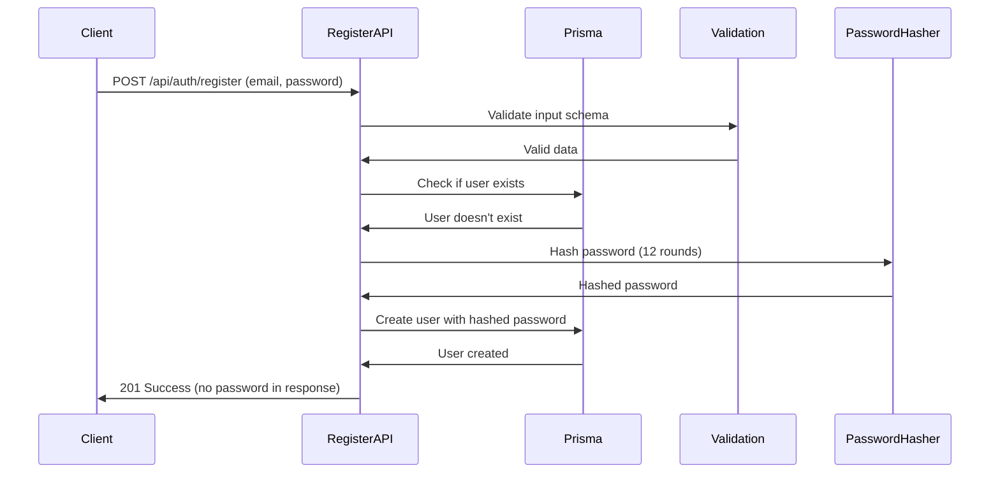
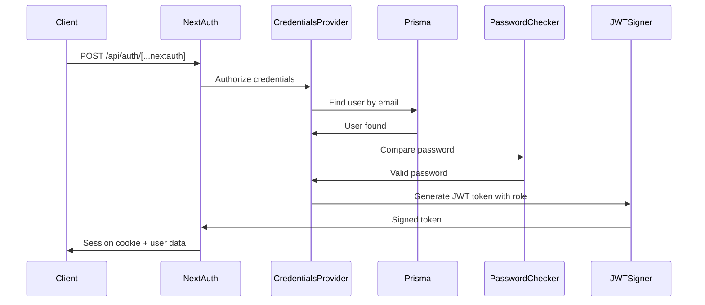
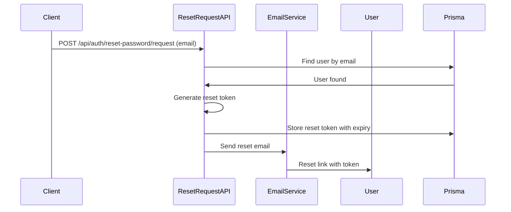

# Authentication System

[← Back to Index](index.md)

**Part of**: DeepWiki Architecture Documentation
**Generated**: 19 November 2025
**Source commit**: 2be6259

---

## Authentication Overview

DeepWiki implements a **comprehensive authentication system** using NextAuth.js v5 with credential-based authentication, role-based access control, and secure session management. The system is designed for **security, scalability, and user experience** with features including user registration, login, password reset, and role management.

### Security Architecture

- **Password Security**: bcrypt hashing with 12 salt rounds
- **Session Management**: JWT-based stateless sessions
- **Role-Based Access**: USER and ADMIN role segregation
- **Route Protection**: Automatic authentication checks
- **Input Validation**: Zod schema validation
- **Security Headers**: Built-in security header configuration

---

## Authentication Flow

### User Registration Flow



### User Login Flow



### Password Reset Flow



---

## NextAuth.js Configuration

### Core Configuration

**File**: `lib/auth.ts:1-90`

```typescript
import NextAuth from 'next-auth'
import CredentialsProvider from 'next-auth/providers/credentials'
import bcrypt from 'bcryptjs'
import { prisma } from './database'

export const { handlers, signIn, signOut, auth } = NextAuth({
  // Trust host for Docker/network environments
  trustHost: true,
  // Secret for JWT signing
  secret: process.env.NEXTAUTH_SECRET,
  // Authentication providers
  providers: [
    CredentialsProvider({
      name: 'credentials',
      credentials: {
        email: { label: 'Email', type: 'email' },
        password: { label: 'Password', type: 'password' }
      },
      // Authentication logic
      async authorize(credentials) {
        if (!credentials?.email || !credentials?.password) {
          return null
        }

        // Find user in database
        const user = await prisma.user.findUnique({
          where: { email: credentials.email as string }
        })

        if (!user) {
          return null
        }

        // Verify password
        const isPasswordValid = await bcrypt.compare(
          credentials.password as string,
          user.password
        )

        if (!isPasswordValid) {
          return null
        }

        // Return user data (without password)
        return {
          id: user.id,
          email: user.email,
          role: user.role,
        }
      }
    })
  ],
  // Session configuration
  session: {
    strategy: 'jwt' // Stateless JWT sessions
  },
  // Callback configuration
  callbacks: {
    // Add role to JWT token
    async jwt({ token, user }) {
      if (user) {
        token.role = user.role
      }
      return token
    },
    // Add role to session
    async session({ session, token }) {
      if (token) {
        session.user.id = token.sub!
        session.user.role = token.role as string
      }
      return session
    }
  },
  // Custom pages
  pages: {
    signIn: '/login',
  },
  // Security configuration
  useSecureCookies: process.env.NODE_ENV === 'production',
})
```

### Session Management

The system uses **JWT-based stateless sessions** for scalability and security:

**JWT Token Structure** (from `lib/auth.ts:52-64`):
```typescript
// JWT token contains:
{
  sub: "user-id",           // Subject (user ID)
  email: "user@example.com", // User email
  role: "USER" | "ADMIN",   // User role
  iat: 1234567890,          // Issued at
  exp: 1234567890          // Expires at
}

// Session includes:
{
  user: {
    id: "user-id",
    email: "user@example.com",
    role: "USER" | "ADMIN"
  }
}
```

### Cookie Configuration

**Security Cookies** (from `lib/auth.ts:70-89`):
```typescript
cookies: {
  sessionToken: {
    name: `next-auth.session-token`,
    options: {
      httpOnly: true,        // Prevent XSS
      sameSite: 'lax',       // CSRF protection
      secure: false,         // HTTPS in production
      path: '/',             // Available site-wide
    },
  },
  csrfToken: {
    name: `next-auth.csrf-token`,
    options: {
      httpOnly: true,
      sameSite: 'lax',
      secure: false,
      path: '/',
    },
  },
}
```

---

## User Registration

### Registration Process

**API Endpoint**: `app/api/auth/register/route.ts:6-63`

The registration endpoint handles user creation with validation and security:

```typescript
export async function POST(request: NextRequest) {
  try {
    // Parse request body
    const body = await request.json()

    // Validate input using Zod schema
    const validatedFields = registerSchema.safeParse(body)

    if (!validatedFields.success) {
      return NextResponse.json(
        { error: 'Invalid input data' },
        { status: 400 }
      )
    }

    const { email, password } = validatedFields.data

    // Check if user already exists
    const existingUser = await prisma.user.findUnique({
      where: { email }
    })

    if (existingUser) {
      return NextResponse.json(
        { error: 'Email already exists' },
        { status: 400 }
      )
    }

    // Hash password with 12 rounds
    const hashedPassword = await bcrypt.hash(password, 12)

    // Create user with default USER role
    const user = await prisma.user.create({
      data: {
        email,
        password: hashedPassword,
        role: 'USER',
      }
    })

    // Return success without password
    const { password: _, ...userWithoutPassword } = user

    return NextResponse.json(
      {
        message: 'User created successfully',
        user: userWithoutPassword
      },
      { status: 201 }
    )
  } catch (error) {
    console.error('Registration error:', error)
    return NextResponse.json(
      { error: 'Internal server error' },
      { status: 500 }
    )
  }
}
```

### Password Requirements

**File**: `lib/validations.ts:15-35`

The system enforces strong password requirements:

```typescript
export const registerSchema = z.object({
  email: z.string().email('Invalid email address'),
  password: z.string()
    .min(8, 'Password must be at least 8 characters')
    .regex(/^(?=.*[a-z])(?=.*[A-Z])(?=.*\d)/,
      'Password must contain uppercase, lowercase, and number'),
  confirmPassword: z.string(),
}).refine((data) => data.password === data.confirmPassword, {
  message: "Passwords don't match",
  path: ["confirmPassword"],
})
```

**Password Requirements**:
- Minimum 8 characters
- At least one uppercase letter
- At least one lowercase letter
- At least one number
- Password confirmation match

---

## Login and Session Management

### Login Form

**File**: `components/auth/LoginForm.tsx:1-60`

The login form integrates React Hook Form with NextAuth.js:

```typescript
import { useForm } from 'react-hook-form'
import { zodResolver } from '@hookform/resolvers/zod'
import { signIn } from 'next-auth/react'
import { useState } from 'react'

export function LoginForm() {
  const [isLoading, setIsLoading] = useState(false)
  const [error, setError] = useState('')

  const form = useForm({
    resolver: zodResolver(loginSchema),
    defaultValues: {
      email: '',
      password: '',
    }
  })

  const onSubmit = async (data) => {
    setIsLoading(true)
    setError('')

    try {
      const result = await signIn('credentials', {
        email: data.email,
        password: data.password,
        redirect: false,
      })

      if (result?.error) {
        setError('Invalid email or password')
      } else {
        // Redirect to dashboard on success
        window.location.href = '/dashboard'
      }
    } catch (error) {
      setError('An error occurred. Please try again.')
    } finally {
      setIsLoading(false)
    }
  }

  return (
    <form onSubmit={form.handleSubmit(onSubmit)}>
      {/* Form fields */}
      {error && <Alert type="error" message={error} />}
    </form>
  )
}
```

### Session Context

**File**: `app/dashboard/page.tsx:1-30`

Using the session in components:

```typescript
import { useSession } from 'next-auth/react'

export default function Dashboard() {
  const { data: session, status } = useSession()

  if (status === 'loading') {
    return <div>Loading...</div>
  }

  if (status === 'unauthenticated') {
    // Redirect to login
    return <div>Please log in</div>
  }

  return (
    <div>
      <h1>Welcome, {session.user.email}</h1>
      <p>Your role: {session.user.role}</p>
      {/* Dashboard content */}
    </div>
  )
}
```

---

## Role-Based Access Control

### User Roles

**Database Model**: `prisma/schema.prisma:79-82`

```prisma
enum Role {
  USER
  ADMIN
}
```

**Role Hierarchy**:
- **USER**: Can view and manage wikis they have access to
- **ADMIN**: Full system access, user management, analytics

### Protected Routes

**File**: `components/layout/ProtectedRoute.tsx:1-40`

Route protection component:

```typescript
interface ProtectedRouteProps {
  children: React.ReactNode
  requireAdmin?: boolean
}

export function ProtectedRoute({ children, requireAdmin = false }: ProtectedRouteProps) {
  const { data: session, status } = useSession()

  if (status === 'loading') {
    return <div>Loading...</div>
  }

  if (status === 'unauthenticated') {
    // Redirect to login
    return <div>Please log in to access this page</div>
  }

  if (requireAdmin && session.user.role !== 'ADMIN') {
    // Admin required but user is not admin
    return <div>Access denied. Admin privileges required.</div>
  }

  return <>{children}</>
}
```

### Usage Example

**File**: `app/dashboard/page.tsx:15-25`

```typescript
// Protect entire page
export default function Dashboard() {
  return (
    <ProtectedRoute>
      <div>Dashboard content</div>
    </ProtectedRoute>
  )
}

// Admin-only page
export default function AdminPage() {
  return (
    <ProtectedRoute requireAdmin={true}>
      <div>Admin content</div>
    </ProtectedRoute>
  )
}
```

---

## Password Reset System

### Reset Request

**API Endpoint**: `app/api/auth/reset-password/request/route.ts:1-50`

```typescript
export async function POST(request: NextRequest) {
  try {
    const body = await request.json()
    const { email } = body

    // Find user by email
    const user = await prisma.user.findUnique({
      where: { email }
    })

    // Always return success (security best practice)
    if (!user) {
      return NextResponse.json({
        message: 'If an account with that email exists, a reset link has been sent.'
      })
    }

    // Generate reset token
    const resetToken = crypto.randomUUID()
    const resetTokenExpiry = new Date(Date.now() + 3600000) // 1 hour

    // Store reset token in database
    // (In a real implementation, you'd add fields to the User model)

    // Send email with reset link
    await sendPasswordResetEmail(email, resetToken)

    return NextResponse.json({
      message: 'If an account with that email exists, a reset link has been sent.'
    })
  } catch (error) {
    console.error('Password reset request error:', error)
    return NextResponse.json(
      { error: 'Internal server error' },
      { status: 500 }
    )
  }
}
```

### Password Reset Confirmation

**API Endpoint**: `app/api/auth/reset-password/confirm/route.ts:20-60`

```typescript
export async function POST(request: NextRequest) {
  try {
    const body = await request.json()
    const { token, newPassword } = body

    // Validate the reset token from the database
    const user = await prisma.user.findFirst({
      where: {
        resetToken: token,
        resetTokenExpiry: { gt: new Date() }
      }
    })

    if (!user) {
      return NextResponse.json(
        { error: 'Invalid or expired reset token' },
        { status: 400 }
      )
    }

    // Hash new password
    const hashedPassword = await bcrypt.hash(newPassword, 12)

    // Update user password and clear reset token
    await prisma.user.update({
      where: { id: user.id },
      data: {
        password: hashedPassword,
        resetToken: null,
        resetTokenExpiry: null
      }
    })

    return NextResponse.json({
      message: 'Password reset successfully'
    })
  } catch (error) {
    console.error('Password reset confirm error:', error)
    return NextResponse.json(
      { error: 'Internal server error' },
      { status: 500 }
    )
  }
}
```

---

## Security Features

### Password Security

- **bcrypt Hashing**: 12 salt rounds for secure hashing
- **No Plaintext Storage**: Passwords never stored in plain text
- **Salt Generation**: Unique salt for each password
- **Password Requirements**: Enforced complexity requirements

### Session Security

- **JWT Tokens**: Stateless, signed tokens
- **HttpOnly Cookies**: XSS attack prevention
- **SameSite Protection**: CSRF protection
- **Secure Cookies**: HTTPS enforcement in production
- **Session Timeout**: Automatic token expiration

### Input Validation

- **Zod Schemas**: Runtime type validation
- **Email Validation**: RFC-compliant email checking
- **Password Strength**: Complexity requirements
- **SQL Injection Protection**: Prisma ORM parameterization

### Security Headers

**File**: `next.config.js:22-46`

```javascript
async headers() {
  return [
    {
      source: '/(.*)',
      headers: [
        { key: 'X-Frame-Options', value: 'DENY' },           // Clickjacking
        { key: 'X-Content-Type-Options', value: 'nosniff' }, // MIME sniffing
        { key: 'Referrer-Policy', value: 'strict-origin-when-cross-origin' },
        { key: 'Permissions-Policy', value: 'camera=(), microphone=(), geolocation=()' }
      ]
    }
  ];
}
```

---

## Authentication Components

### Component Overview

| Component | File Location | Purpose | Key Features |
|-----------|---------------|---------|--------------|
| **LoginForm** | `components/auth/LoginForm.tsx:1-60` | User login interface | Form validation, error handling, loading states |
| **RegisterForm** | `components/auth/RegisterForm.tsx:1-80` | User registration | Password confirmation, validation |
| **PasswordResetForm** | `components/auth/PasswordResetForm.tsx:1-50` | Password reset | Email input, token handling |
| **ProtectedRoute** | `components/layout/ProtectedRoute.tsx:1-40` | Route protection | Role-based access, automatic redirects |

### Form Validation

**File**: `lib/validations.ts:15-50`

```typescript
// Login validation schema
export const loginSchema = z.object({
  email: z.string().email('Invalid email address'),
  password: z.string().min(1, 'Password is required')
})

// Registration validation schema
export const registerSchema = z.object({
  email: z.string().email('Invalid email address'),
  password: z.string()
    .min(8, 'Password must be at least 8 characters')
    .regex(/^(?=.*[a-z])(?=.*[A-Z])(?=.*\d)/,
      'Password must contain uppercase, lowercase, and number'),
  confirmPassword: z.string(),
}).refine((data) => data.password === data.confirmPassword, {
  message: "Passwords don't match",
  path: ["confirmPassword"],
})

// Password reset validation schema
export const passwordResetSchema = z.object({
  email: z.string().email('Invalid email address')
})

export const passwordResetConfirmSchema = z.object({
  token: z.string().min(1, 'Reset token is required'),
  newPassword: z.string()
    .min(8, 'Password must be at least 8 characters')
    .regex(/^(?=.*[a-z])(?=.*[A-Z])(?=.*\d)/,
      'Password must contain uppercase, lowercase, and number'),
  confirmPassword: z.string(),
}).refine((data) => data.newPassword === data.confirmPassword, {
  message: "Passwords don't match",
  path: ["confirmPassword"],
})
```

---

## API Endpoints Summary

### Authentication Endpoints

| Endpoint | Method | File Location | Purpose | Auth Required |
|----------|--------|---------------|---------|---------------|
| `/api/auth/register` | POST | `app/api/auth/register/route.ts:6-63` | User registration | No |
| `/api/auth/[...nextauth]` | POST | `app/api/auth/[...nextauth]/route.ts:1-30` | Login/logout | No |
| `/api/auth/reset-password/request` | POST | `app/api/auth/reset-password/request/route.ts:1-50` | Request reset | No |
| `/api/auth/reset-password/confirm` | POST | `app/api/auth/reset-password/confirm/route.ts:1-60` | Confirm reset | No |

### Response Formats

**Registration Success** (201):
```json
{
  "message": "User created successfully",
  "user": {
    "id": "user-id",
    "email": "user@example.com",
    "role": "USER"
  }
}
```

**Login Success** (200):
```json
{
  "user": {
    "id": "user-id",
    "email": "user@example.com",
    "role": "USER"
  },
  "expires": "2024-01-01T00:00:00.000Z"
}
```

**Error Response** (400/401/500):
```json
{
  "error": "Error message describing the issue"
}
```

---

## Database Schema

### User Model

**File**: `prisma/schema.prisma:16-27`

```prisma
model User {
  id        String   @id @default(cuid())
  email     String   @unique
  password  String
  role      Role     @default(USER)
  createdAt DateTime @default(now())
  updatedAt DateTime @updatedAt

  // Relations
  wikiVersions WikiVersion[]

  @@map("users")
}
```

**User Fields**:
- `id`: Unique identifier (CUID)
- `email`: Unique email address
- `password`: Hashed password (bcrypt)
- `role`: User role (USER/ADMIN)
- `createdAt`: Account creation timestamp
- `updatedAt`: Last update timestamp

**Indexes**:
- `email`: Unique index for login lookup

---

## Testing

### Authentication Tests

**Unit Tests**: `__tests__/models/wiki.test.ts:1-30`

```typescript
import { render, screen, fireEvent, waitFor } from '@testing-library/react'
import { LoginForm } from '@/components/auth/LoginForm'

describe('LoginForm', () => {
  it('renders login form', () => {
    render(<LoginForm />)
    expect(screen.getByLabelText(/email/i)).toBeInTheDocument()
    expect(screen.getByLabelText(/password/i)).toBeInTheDocument()
  })

  it('validates form submission', async () => {
    render(<LoginForm />)
    fireEvent.submit(screen.getByRole('form'))
    await waitFor(() => {
      expect(screen.getByText(/invalid email/i)).toBeInTheDocument()
    })
  })
})
```

**E2E Tests**: `tests/e2e/auth.spec.ts:1-50`

```typescript
import { test, expect } from '@playwright/test'

test.describe('Authentication', () => {
  test('user can register', async ({ page }) => {
    await page.goto('/register')
    await page.fill('[name="email"]', 'test@example.com')
    await page.fill('[name="password"]', 'Password123')
    await page.fill('[name="confirmPassword"]', 'Password123')
    await page.click('button[type="submit"]')
    await expect(page).toHaveURL('/dashboard')
  })

  test('user can login', async ({ page }) => {
    await page.goto('/login')
    await page.fill('[name="email"]', 'user@example.com')
    await page.fill('[name="password"]', 'password123')
    await page.click('button[type="submit"]')
    await expect(page).toHaveURL('/dashboard')
  })
})
```

---

## Best Practices

### Security Best Practices

1. **Password Security**
   - Always use bcrypt with high salt rounds (12+)
   - Never store passwords in plain text
   - Enforce password complexity requirements
   - Implement password expiration policies

2. **Session Management**
   - Use HttpOnly cookies for session tokens
   - Implement proper SameSite policies
   - Use secure cookies in production
   - Set appropriate session timeouts

3. **Input Validation**
   - Validate all inputs on both client and server
   - Use schema validation libraries (Zod)
   - Sanitize user inputs
   - Implement rate limiting

4. **Error Handling**
   - Don't expose sensitive information in errors
   - Use generic error messages for security
   - Log errors server-side for debugging
   - Implement proper error boundaries

### Implementation Best Practices

1. **Type Safety**
   - Use TypeScript for type safety
   - Define proper interfaces for user data
   - Use Prisma for database type safety
   - Validate data at runtime

2. **User Experience**
   - Provide clear error messages
   - Implement loading states
   - Use proper form validation feedback
   - Implement proper redirects

3. **Code Organization**
   - Separate auth logic from UI components
   - Use custom hooks for auth state
   - Implement proper error boundaries
   - Use consistent naming conventions

---

**Next**: [API Design](api-design.md) →
