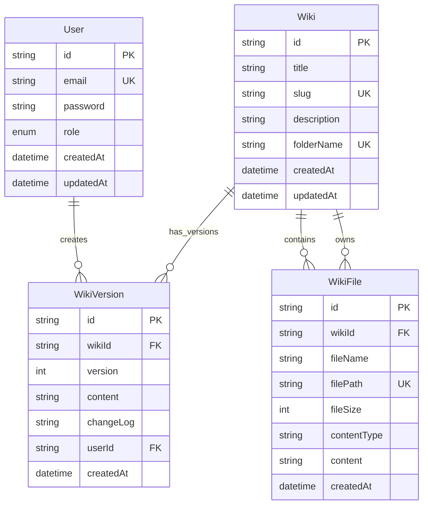
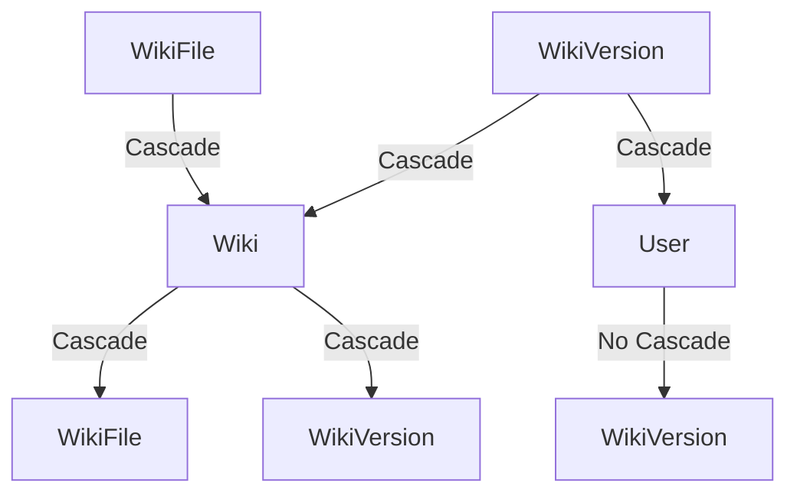

# Database Layer

[← Back to Index](index.md)

**Part of**: DeepWiki Architecture Documentation
**Generated**: 19 November 2025
**Source commit**: 2be6259

---

## Database Architecture Overview

DeepWiki uses **Prisma 6.18.0** as the primary database abstraction layer with **PostgreSQL** as the relational database backend. The database layer provides **type-safe queries**, **migrations**, and **relationship management** for a comprehensive wiki management system with user authentication, file storage, and version control.

### Database Technology Stack

- **PostgreSQL 15**: Primary relational database
- **Prisma 6.18.0**: Type-safe database ORM
- **Prisma Client 6.18.0**: Database query interface
- **TypeScript**: Full type safety from database to application

### Key Design Principles

- **Type Safety**: Prisma generates TypeScript types from schema
- **Relationship Integrity**: Foreign key constraints and cascading deletes
- **Performance**: Strategic indexing for query optimization
- **Scalability**: Normalized schema with efficient queries
- **Audit Trail**: Version control with change tracking

---

## Database Configuration

### Prisma Client Setup

**File**: `lib/database.ts:1-34`

```typescript
import { PrismaClient } from '@prisma/client'

// Global singleton to prevent multiple instances in development
const globalForPrisma = globalThis as unknown as {
  prisma: PrismaClient | undefined
  shutdownHandler: (() => void) | undefined
}

// Create Prisma client with optimized configuration
export const prisma =
  globalForPrisma.prisma ??
  new PrismaClient({
    // Logging configuration
    log: process.env.NODE_ENV === 'development'
      ? ['error', 'warn']     // Log errors and warnings in dev
      : ['error'],            // Log only errors in production
    errorFormat: 'pretty',   // Human-readable error format
  })

// Hot reload protection - reuse same instance
if (process.env.NODE_ENV !== 'production') {
  globalForPrisma.prisma = prisma
}

// Graceful shutdown handling
if (typeof process !== 'undefined' && !globalForPrisma.shutdownHandler) {
  const shutdownHandler = async () => {
    await prisma.$disconnect()
  }

  // Multiple event listeners for comprehensive cleanup
  process.on('beforeExit', shutdownHandler)
  process.on('SIGINT', shutdownHandler)
  process.on('SIGTERM', shutdownHandler)

  globalForPrisma.shutdownHandler = shutdownHandler
}
```

**Key Configuration Features**:
- **Connection Reuse**: Global singleton pattern prevents multiple connections
- **Development Optimization**: Disabled for production to allow scaling
- **Logging Control**: Environment-based logging levels
- **Error Formatting**: Human-readable error messages
- **Graceful Shutdown**: Proper cleanup on process termination

---

## Database Schema

### Schema Configuration

**File**: `prisma/schema.prisma:7-14`

```prisma
generator client {
  provider = "prisma-client-js"  // Prisma Client generator
}

datasource db {
  provider = "postgresql"         // PostgreSQL database
  url      = env("DATABASE_URL")  // Connection string from env
}
```

### Entity Relationship Diagram



---

## Data Models

### User Model

**File**: `prisma/schema.prisma:16-27`

```prisma
model User {
  id        String   @id @default(cuid())
  email     String   @unique
  password  String
  role      Role     @default(USER)
  createdAt DateTime @default(now())
  updatedAt DateTime @updatedAt

  // Relationships
  wikiVersions WikiVersion[]

  @@map("users")
}
```

**Field Details**:
- `id`: Auto-generated unique identifier (CUID)
- `email`: Unique email address for authentication
- `password`: Hashed password (bcrypt)
- `role`: User role (USER or ADMIN) with default USER
- `createdAt`: Account creation timestamp
- `updatedAt`: Last profile update timestamp

**Indexes**:
- **Primary Key**: `id` (clustered index)
- **Unique Index**: `email` (for fast login lookups)

**Relationships**:
- **One-to-Many**: User → WikiVersion (user creates versions)

**Security Features**:
- **Email Uniqueness**: Prevents duplicate accounts
- **Password Hashing**: Secure storage with bcrypt
- **Role-Based Access**: Supports admin/user segregation

### Wiki Model

**File**: `prisma/schema.prisma:29-42`

```prisma
model Wiki {
  id          String   @id @default(cuid())
  title       String
  slug        String   @unique
  description String?
  folderName  String   @unique
  createdAt   DateTime @default(now())
  updatedAt   DateTime @updatedAt

  // Relationships
  files       WikiFile[]
  versions    WikiVersion[]

  @@map("wikis")
}
```

**Field Details**:
- `id`: Auto-generated unique identifier
- `title`: Human-readable wiki title
- `slug`: URL-friendly identifier (unique)
- `description`: Optional wiki description
- `folderName`: Unique folder identifier for file organization
- `createdAt`: Wiki creation timestamp
- `updatedAt`: Last modification timestamp

**Indexes**:
- **Primary Key**: `id`
- **Unique Index**: `slug` (for fast URL lookups)
- **Unique Index**: `folderName` (for file organization)

**Relationships**:
- **One-to-Many**: Wiki → WikiFile (wiki contains files)
- **One-to-Many**: Wiki → WikiVersion (wiki has version history)

**Data Validation**:
- **Title Required**: Must have a non-empty title
- **Slug Uniqueness**: Ensures clean URLs
- **Folder Uniqueness**: Prevents file conflicts

### WikiFile Model

**File**: `prisma/schema.prisma:44-59`

```prisma
model WikiFile {
  id          String   @id @default(cuid())
  wikiId      String
  fileName    String
  filePath    String   @unique
  fileSize    Int
  contentType String
  content     String?  // Optional content for full-text search
  createdAt   DateTime @default(now())

  // Relationships
  wiki        Wiki     @relation(fields: [wikiId], references: [id], onDelete: Cascade)

  @@map("wiki_files")
  @@index([wikiId])           // Foreign key index
  @@index([contentType])      // File type filtering
}
```

**Field Details**:
- `id`: Auto-generated unique identifier
- `wikiId`: Foreign key to parent Wiki
- `fileName`: Original filename (e.g., "readme.md")
- `filePath`: Full path including folder (unique)
- `fileSize`: File size in bytes
- `contentType`: MIME type (e.g., "text/markdown")
- `content`: Optional file content for search
- `createdAt`: File upload timestamp

**Indexes**:
- **Primary Key**: `id`
- **Unique Index**: `filePath` (prevents duplicate files)
- **Foreign Key Index**: `wikiId` (for parent lookups)
- **Content Type Index**: `contentType` (for filtering)

**Relationships**:
- **Many-to-One**: WikiFile → Wiki (belongs to wiki)
- **Cascade Delete**: Deleting wiki deletes all files

**Optimization Features**:
- **Optional Content**: Store content only when needed for search
- **File Size Tracking**: Monitor storage usage
- **Path Uniqueness**: Prevent file conflicts
- **Type Indexing**: Fast file type filtering

### WikiVersion Model

**File**: `prisma/schema.prisma:61-77`

```prisma
model WikiVersion {
  id        String   @id @default(cuid())
  wikiId    String
  version   Int
  content   String
  changeLog String?
  userId    String
  createdAt DateTime @default(now())

  // Relationships
  wiki      Wiki     @relation(fields: [wikiId], references: [id], onDelete: Cascade)
  user      User     @relation(fields: [userId], references: [id], onDelete: Cascade)

  @@unique([wikiId, version])  // Unique version per wiki
  @@map("wiki_versions")
  @@index([wikiId])           // Version lookups
  @@index([userId])           // User activity tracking
}
```

**Field Details**:
- `id`: Auto-generated unique identifier
- `wikiId`: Foreign key to Wiki
- `version`: Version number (integer)
- `content`: Version content snapshot
- `changeLog`: Optional change description
- `userId`: Foreign key to User who created version
- `createdAt`: Version creation timestamp

**Indexes**:
- **Primary Key**: `id`
- **Composite Unique**: `wikiId + version` (prevents duplicate versions)
- **Foreign Key Index**: `wikiId` (for wiki version queries)
- **User Index**: `userId` (for activity tracking)

**Relationships**:
- **Many-to-One**: WikiVersion → Wiki (belongs to wiki)
- **Many-to-One**: WikiVersion → User (created by user)
- **Cascade Delete**: Deleting wiki or user deletes versions

**Version Control Features**:
- **Version Uniqueness**: Each version number is unique per wiki
- **Content Snapshot**: Full content stored for each version
- **Change Tracking**: Optional change log
- **User Attribution**: Track who made changes

### Role Enum

**File**: `prisma/schema.prisma:79-82`

```prisma
enum Role {
  USER
  ADMIN
}
```

**Role Definitions**:
- **USER**: Standard user with basic permissions
- **ADMIN**: Administrative user with full system access

---

## Database Relationships

### Relationship Map

| Parent | Relationship | Child | Type | Cascade |
|--------|-------------|--------|------|---------|
| User | One-to-Many | WikiVersion | Strong | Yes |
| Wiki | One-to-Many | WikiFile | Strong | Yes |
| Wiki | One-to-Many | WikiVersion | Strong | Yes |
| Wiki | One-to-Many | WikiFile | Strong | Yes |

### Cascade Rules



**Cascade Behavior**:
- **Deleting User**: Does NOT delete wiki versions (prevents data loss)
- **Deleting Wiki**: DOES delete all wiki files and versions
- **Deleting WikiFile**: Does not affect other records
- **Deleting WikiVersion**: Does not affect other records

---

## Database Operations

### Connection Management

**File**: `lib/database.ts:8-19`

```typescript
// Connection pooling configuration
export const prisma = new PrismaClient({
  log: process.env.NODE_ENV === 'development' ? ['error', 'warn'] : ['error'],
  errorFormat: 'pretty',
})

// Development hot reload protection
if (process.env.NODE_ENV !== 'production') {
  globalForPrisma.prisma = prisma
}
```

**Connection Features**:
- **Environment Logging**: Different log levels for dev/prod
- **Hot Reload Protection**: Prevents connection leaks in development
- **Error Formatting**: Human-readable error messages
- **Graceful Disconnection**: Proper cleanup on shutdown

### Transaction Management

**Example**: Wrapping multiple operations in a transaction

```typescript
// Create wiki with files in a transaction
const result = await prisma.$transaction(async (tx) => {
  // Create wiki
  const wiki = await tx.wiki.create({
    data: {
      title: 'My Wiki',
      slug: 'my-wiki',
      description: 'A test wiki',
      folderName: 'my-wiki-folder'
    }
  })

  // Create files
  const files = await tx.wikiFile.createMany({
    data: [
      {
        wikiId: wiki.id,
        fileName: 'readme.md',
        filePath: 'my-wiki-folder/readme.md',
        fileSize: 1024,
        contentType: 'text/markdown'
      }
    ]
  })

  return { wiki, files }
})
```

**Transaction Benefits**:
- **Atomicity**: All operations succeed or all fail
- **Consistency**: Database remains in valid state
- **Isolation**: Concurrent transactions don't interfere
- **Durability**: Committed transactions are permanent

---

## Data Seeding

### Seed Configuration

**File**: `package.json:22-24`

```json
{
  "prisma": {
    "seed": "tsx prisma/seed.ts"
  }
}
```

**Seed Script**: `prisma db seed` uses TypeScript execution

### Seed Implementation

**File**: `prisma/seed.ts:6-69`

```typescript
import { PrismaClient } from '@prisma/client'
import bcrypt from 'bcryptjs'

const prisma = new PrismaClient()

async function main() {
  // Create admin user
  const adminEmail = 'admin@deepwiki.com'
  const adminPassword = 'Admin123!'

  const existingAdmin = await prisma.user.findUnique({
    where: { email: adminEmail }
  })

  if (!existingAdmin) {
    const hashedPassword = await bcrypt.hash(adminPassword, 12)

    const admin = await prisma.user.create({
      data: {
        email: adminEmail,
        password: hashedPassword,
        role: 'ADMIN',
      },
    })

    console.log('✅ Admin user created successfully:')
    console.log(`   Email: ${admin.email}`)
    console.log(`   Password: ${adminPassword}`)
    console.log(`   Role: ${admin.role}`)
  }

  // Create test user
  const testEmail = 'user@deepwiki.com'
  const testPassword = 'User123!'

  const existingTestUser = await prisma.user.findUnique({
    where: { email: testEmail }
  })

  if (!existingTestUser) {
    const hashedPassword = await bcrypt.hash(testPassword, 12)

    const testUser = await prisma.user.create({
      data: {
        email: testEmail,
        password: hashedPassword,
        role: 'USER',
      },
    })

    console.log('✅ Test user created successfully:')
    console.log(`   Email: ${testUser.email}`)
    console.log(`   Password: ${testPassword}`)
    console.log(`   Role: ${testUser.role}`)
  }
}

main()
  .catch((e) => {
    console.error(e)
    process.exit(1)
  })
  .finally(async () => {
    await prisma.$disconnect()
  })
```

### Default Test Accounts

**Admin Account**:
- **Email**: `admin@deepwiki.com`
- **Password**: `Admin123!`
- **Role**: `ADMIN`
- **Permissions**: Full system access

**User Account**:
- **Email**: `user@deepwiki.com`
- **Password**: `User123!`
- **Role**: `USER`
- **Permissions**: Standard user access

**Security Features**:
- **Password Hashing**: bcrypt with 12 salt rounds
- **Idempotent**: Safe to run multiple times
- **Error Handling**: Proper cleanup on failure
- **Logging**: Clear success/failure messages

---

## Query Patterns

### User Queries

**Find user by email**:
```typescript
const user = await prisma.user.findUnique({
  where: { email: 'user@example.com' }
})
```

**Get user with versions**:
```typescript
const userWithVersions = await prisma.user.findUnique({
  where: { email: 'user@example.com' },
  include: {
    wikiVersions: {
      include: {
        wiki: {
          select: {
            title: true,
            slug: true
          }
        }
      }
    }
  }
})
```

### Wiki Queries

**Find wiki with files**:
```typescript
const wiki = await prisma.wiki.findUnique({
  where: { slug: 'my-wiki' },
  include: {
    files: true,
    versions: {
      include: {
        user: {
          select: {
            email: true
          }
        }
      }
    }
  }
})
```

**Search wikis by title**:
```typescript
const wikis = await prisma.wiki.findMany({
  where: {
    title: {
      contains: 'docker',
      mode: 'insensitive'
    }
  },
  orderBy: {
    updatedAt: 'desc'
  },
  take: 10
})
```

**Get wiki statistics**:
```typescript
const stats = await prisma.wiki.aggregate({
  _count: {
    id: true
  },
  _sum: {
    // Aggregate file sizes through files relationship
  }
})
```

### WikiFile Queries

**Find files by type**:
```typescript
const markdownFiles = await prisma.wikiFile.findMany({
  where: {
    contentType: {
      contains: 'markdown'
    }
  },
  include: {
    wiki: {
      select: {
        title: true,
        slug: true
      }
    }
  }
})
```

**Get file with wiki info**:
```typescript
const file = await prisma.wikiFile.findUnique({
  where: { id: fileId },
  include: {
    wiki: {
      select: {
        title: true,
        slug: true,
        description: true
      }
    }
  }
})
```

### Version Queries

**Get wiki version history**:
```typescript
const versions = await prisma.wikiVersion.findMany({
  where: { wikiId },
  include: {
    user: {
      select: {
        email: true
      }
    }
  },
  orderBy: {
    version: 'desc'
  }
})
```

**Get latest version**:
```typescript
const latestVersion = await prisma.wikiVersion.findFirst({
  where: { wikiId },
  orderBy: {
    version: 'desc'
  }
})
```

---

## Performance Optimizations

### Indexing Strategy

**Primary Indexes**:
- **User.id**: Clustered primary key
- **Wiki.slug**: Unique for URL lookups
- **WikiFile.filePath**: Unique for file access
- **WikiVersion.wikiId + version**: Composite unique

**Foreign Key Indexes**:
- **WikiFile.wikiId**: Fast wiki file lookups
- **WikiVersion.wikiId**: Fast version queries
- **WikiVersion.userId**: Fast user activity queries

**Query Optimization Indexes**:
- **WikiFile.contentType**: Fast file type filtering
- **Wiki.updatedAt**: Fast recent wikis queries
- **Wiki.createdAt**: Fast chronological queries

### Query Optimization

**Efficient Pagination**:
```typescript
// Use cursor-based pagination for large datasets
const wikis = await prisma.wiki.findMany({
  take: 20,
  skip: 0,
  orderBy: {
    updatedAt: 'desc'
  }
})
```

**Selective Field Loading**:
```typescript
// Load only needed fields
const wikis = await prisma.wiki.findMany({
  select: {
    id: true,
    title: true,
    slug: true,
    description: true
  }
})
```

**Batch Operations**:
```typescript
// Use createMany for batch inserts
await prisma.wikiFile.createMany({
  data: files,
  skipDuplicates: true
})
```

### Connection Pooling

**Prisma Connection Management**:
- **Connection Pooling**: Automatic connection reuse
- **Connection Limits**: Prevents connection exhaustion
- **Query Optimization**: Optimized SQL generation
- **Transaction Support**: ACID compliance

---

## Migration Strategy

### Migration Commands

**Generate Migration**:
```bash
npm run db:generate    # Generate Prisma Client
npm run db:migrate     # Apply database migrations
```

**Migration Workflow**:
1. Modify `prisma/schema.prisma`
2. Run `npm run db:generate`
3. Create migration: `npx prisma migrate dev --name describe_change`
4. Review generated SQL
5. Apply to database

### Migration Safety

**Best Practices**:
- **Always Review SQL**: Check generated migration SQL
- **Test in Development**: Test migrations on development database
- **Backup Production**: Always backup before production migrations
- **Rollback Plan**: Know how to rollback migrations
- **Idempotent Migrations**: Safe to run multiple times

**Example Migration**:
```sql
-- Add description field to Wiki
ALTER TABLE "wikis" ADD COLUMN "description" TEXT;

-- Add index for better query performance
CREATE INDEX "wikis_updated_at_idx" ON "wikis" ("updatedAt");
```

---

## Data Validation

### Schema-Level Validation

**Prisma Validations**:
```prisma
model User {
  email String @unique  // Database-level uniqueness
  role  Role   @default(USER)  // Enum validation
  createdAt DateTime @default(now())  // Auto timestamp
}
```

**Field Constraints**:
- **Unique Constraints**: Email, slug, filePath
- **Default Values**: Role, timestamps
- **Enum Validation**: Role field
- **Required Fields**: Primary keys, required strings

### Application-Level Validation

**Input Validation with Zod**:
```typescript
import { z } from 'zod'

export const userSchema = z.object({
  email: z.string().email('Invalid email'),
  password: z.string().min(8, 'Password too short'),
  role: z.enum(['USER', 'ADMIN']).default('USER')
})
```

**Database Validation**:
```typescript
// Validate before database operations
const validatedData = userSchema.parse(userData)
const user = await prisma.user.create({
  data: validatedData
})
```

---

## Backup and Recovery

### Database Backup Strategy

**PostgreSQL Backup**:
```bash
# Full database backup
pg_dump $DATABASE_URL > backup.sql

# Restore from backup
psql $DATABASE_URL < backup.sql
```

**Automated Backups**:
- **Daily Full Backups**: Complete database snapshots
- **Incremental Backups**: WAL-E or pgBackRest
- **Point-in-Time Recovery**: Transaction log archiving
- **Cross-Region Replication**: Disaster recovery

### Data Recovery

**Recovery Procedures**:
1. **Identify Issue**: Determine extent of data loss
2. **Restore from Backup**: Latest full backup
3. **Apply WAL Logs**: Point-in-time recovery
4. **Verify Integrity**: Check data consistency
5. **Update Cache**: Clear application caches

---

## Monitoring and Observability

### Database Metrics

**Key Metrics to Monitor**:
- **Connection Count**: Active and idle connections
- **Query Performance**: Slow query detection
- **Deadlock Detection**: Transaction conflicts
- **Storage Usage**: Disk space and growth
- **Replication Lag**: For read replicas

### Error Handling

**Common Error Patterns**:
```typescript
try {
  const user = await prisma.user.findUnique({
    where: { email: 'user@example.com' }
  })
} catch (error) {
  if (error instanceof PrismaClientKnownRequestError) {
    // Handle specific Prisma errors
    console.error('Database error:', error.message)
  } else {
    // Handle unexpected errors
    console.error('Unexpected error:', error)
  }
}
```

**Error Types**:
- **Unique Constraint Violation**: Duplicate email/slug
- **Foreign Key Violation**: Invalid references
- **Connection Errors**: Database unavailable
- **Transaction Conflicts**: Deadlocks or timeouts

---

## Security Considerations

### Data Protection

**Password Security**:
- **bcrypt Hashing**: 12 salt rounds minimum
- **No Plaintext Storage**: Never store passwords unencrypted
- **Salt Generation**: Unique salt per password
- **Password Policies**: Enforce complexity requirements

**Input Sanitization**:
- **SQL Injection Prevention**: Prisma parameterization
- **XSS Protection**: Content sanitization
- **File Upload Validation**: Type and size limits
- **Query Parameterization**: Safe dynamic queries

### Access Control

**Database Permissions**:
- **Principle of Least Privilege**: Minimal required permissions
- **Read/Write Separation**: Different users for read/write operations
- **Role-Based Access**: Admin vs user database access
- **Connection Security**: SSL/TLS for production

**Network Security**:
- **Database Firewall**: Restrict access by IP
- **VPN Access**: Private network connections
- **SSL/TLS**: Encrypted connections
- **Connection String Security**: Environment variable storage

---

## Testing

### Database Testing

**Test Database Setup**:
```typescript
// Test configuration
import { PrismaClient } from '@prisma/client'

const testPrisma = new PrismaClient({
  datasources: {
    db: {
      url: process.env.TEST_DATABASE_URL
    }
  }
})
```

**Test Patterns**:
- **Isolation**: Each test in transaction, rollback after
- **Factory Pattern**: Create test data factories
- **Database Cleaners**: Reset state between tests
- **Mock Data**: Consistent test scenarios

**Test Examples**:
```typescript
// User creation test
it('creates user with valid data', async () => {
  const user = await prisma.user.create({
    data: {
      email: 'test@example.com',
      password: 'hashedpassword',
      role: 'USER'
    }
  })

  expect(user.email).toBe('test@example.com')
  expect(user.role).toBe('USER')
})

// Relationship test
it('loads wiki with files', async () => {
  const wiki = await prisma.wiki.findUnique({
    where: { slug: 'test-wiki' },
    include: { files: true }
  })

  expect(wiki.files).toHaveLength(3)
})
```

---

## Scaling Considerations

### Performance Scaling

**Read Replicas**:
- **Master-Slave Setup**: Read from replicas
- **Write to Master**: All writes to primary
- **Connection Routing**: Route queries appropriately
- **Replica Lag**: Monitor replication delay

**Query Optimization**:
- **Index Usage**: Analyze query plans
- **Query Caching**: Cache frequent queries
- **Batch Operations**: Reduce round trips
- **Connection Pooling**: Reuse connections

### Storage Scaling

**Horizontal Partitioning**:
- **Sharding Strategy**: Partition by wiki or user
- **Cross-Shard Queries**: Minimize cross-partition operations
- **Data Locality**: Keep related data together
- **Shard Key Selection**: Choose appropriate partition key

**Vertical Partitioning**:
- **Column Separation**: Split large columns
- **Archive Strategy**: Move old data to archive
- **Hot/Warm/Cold**: Different storage tiers
- **Index Optimization**: Only index hot data

---

**Next**: [Frontend Architecture](frontend-architecture.md) →
