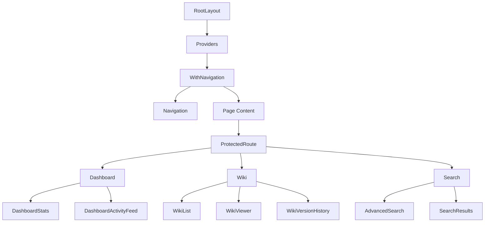

# Frontend Architecture

[← Back to Index](index.md)

**Part of**: DeepWiki Architecture Documentation
**Generated**: 19 November 2025
**Source commit**: 2be6259

---

## Frontend Architecture Overview

DeepWiki's frontend is built with **Next.js 15 App Router** and **React 18**, implementing a modern component-based architecture with **server-side rendering**, **client-side hydration**, and **TypeScript** for type safety. The frontend follows a **modular design pattern** with clear separation between UI components, page components, and layout components.

### Architecture Philosophy

- **Component-Driven Development**: Reusable, composable UI components
- **Type Safety**: Full TypeScript coverage from props to API responses
- **Responsive Design**: Mobile-first approach with Tailwind CSS
- **Performance First**: Server-side rendering with client-side hydration
- **Accessibility**: WCAG compliant with semantic HTML and ARIA labels

### Technology Stack

- **Next.js 15**: React framework with App Router
- **React 18.3.1**: UI library with hooks and concurrent features
- **TypeScript 5.6.0**: Type-safe development
- **Tailwind CSS 3.4.13**: Utility-first CSS framework
- **@tailwindcss/typography**: Typography plugin for markdown
- **React Hook Form 7.66.0**: Performant form management
- **Zod 4.1.12**: Schema validation and type safety

---

## Next.js App Router Structure

### Directory Organization

```
app/
├── (auth)/                 # Authentication route group
│   ├── login/             # Login page
│   ├── register/          # Registration page
│   └── reset-password/    # Password reset flow
├── api/                   # API routes
├── dashboard/             # Protected dashboard
├── wiki/                  # Public wiki pages
│   └── [slug]/           # Dynamic wiki pages
├── upload/                # File upload page
├── search/                # Search interface
├── globals.css            # Global styles
├── layout.tsx            # Root layout
├── page.tsx              # Home page
└── not-found.tsx         # 404 page
```

### Server and Client Components

**File**: `app/layout.tsx:1-30`

```typescript
// Server Component - Root Layout
import { Providers } from '@/components/Providers'
import './globals.css'

export default function RootLayout({
  children,
}: {
  children: React.ReactNode
}) {
  return (
    <html lang="en">
      <body>
        <Providers>
          {children}
        </Providers>
      </body>
    </html>
  )
}
```

**Client Component Usage** (from `components/layout/Navigation.tsx:1-50`):
```typescript
'use client'

import React, { useState, useEffect, useRef } from 'react'
import { useRouter, usePathname } from 'next/navigation'
import { useSession } from 'next-auth/react'
// Client-side interactive components
```

**Component Types**:
- **Server Components**: Render on server, no client-side state
- **Client Components**: Interactive UI with hooks and state
- **Layout Components**: Shared UI across routes
- **Page Components**: Route-specific content

---

## Component Architecture

### Component Hierarchy



### Component Taxonomy

#### 1. UI Components (`components/ui/`)

**File**: `components/ui/Button.tsx:15-28`

```typescript
import { ButtonHTMLAttributes, forwardRef } from 'react'
import { cva, type VariantProps } from 'class-variance-authority'

const buttonVariants = cva(
  // Base styles
  'inline-flex items-center justify-center rounded-md text-sm font-medium',
  {
    variants: {
      variant: {
        default: 'bg-blue-600 text-white hover:bg-blue-700',
        destructive: 'bg-red-600 text-white hover:bg-red-700',
        outline: 'border border-gray-300 hover:bg-gray-50',
        secondary: 'bg-gray-100 text-gray-900 hover:bg-gray-200',
      },
      size: {
        default: 'h-10 px-4 py-2',
        sm: 'h-9 px-3',
        lg: 'h-11 px-8',
      },
    },
    defaultVariants: {
      variant: 'default',
      size: 'default',
    },
  }
)

interface ButtonProps
  extends ButtonHTMLAttributes<HTMLButtonElement>,
    VariantProps<typeof buttonVariants> {
  loading?: boolean
}

export const Button = forwardRef<HTMLButtonElement, ButtonProps>(
  ({ className, variant, size, loading, children, ...props }, ref) => {
    return (
      <button
        className={buttonVariants({ variant, size, className })}
        ref={ref}
        disabled={loading}
        {...props}
      >
        {loading && <Spinner className="mr-2" />}
        {children}
      </button>
    )
  }
)
```

**File**: `components/ui/Input.tsx:1-40`

```typescript
import { InputHTMLAttributes, forwardRef } from 'react'
import { cn } from '@/lib/utils'

export interface InputProps extends InputHTMLAttributes<HTMLInputElement> {
  error?: string
  label?: string
}

export const Input = forwardRef<HTMLInputElement, InputProps>(
  ({ className, type, error, label, ...props }, ref) => {
    return (
      <div className="w-full">
        {label && (
          <label className="block text-sm font-medium text-gray-700 mb-1">
            {label}
          </label>
        )}
        <input
          type={type}
          className={cn(
            'flex h-10 w-full rounded-md border border-gray-300 bg-white px-3 py-2 text-sm',
            'focus:outline-none focus:ring-2 focus:ring-blue-500 focus:border-transparent',
            'disabled:cursor-not-allowed disabled:opacity-50',
            error && 'border-red-500 focus:ring-red-500',
            className
          )}
          ref={ref}
          {...props}
        )}
        {error && (
          <p className="mt-1 text-sm text-red-600">{error}</p>
        )}
      </div>
    )
  }
)
```

**UI Component Library**:

| Component | File Location | Purpose | Key Features |
|-----------|---------------|---------|--------------|
| **Button** | `components/ui/Button.tsx:1-50` | Reusable button with variants | Loading states, disabled, size variants |
| **Input** | `components/ui/Input.tsx:1-40` | Form input with validation | Error states, label support |
| **Alert** | `components/ui/Alert.tsx:1-30` | Success/error messages | Type variants, dismissible |
| **ProgressBar** | `components/ui/ProgressBar.tsx:1-30` | File upload progress | Animated, customizable |

#### 2. Layout Components (`components/layout/`)

**File**: `components/layout/Navigation.tsx:30-100`

```typescript
export function Navigation({ className = '' }: NavigationProps) {
  const router = useRouter()
  const pathname = usePathname()
  const { data: session } = useSession()
  const [activeTab, setActiveTab] = useState<TabType>('home')
  const [isMobileMenuOpen, setIsMobileMenuOpen] = useState(false)
  const [searchQuery, setSearchQuery] = useState('')
  const [searchResults, setSearchResults] = useState<Wiki[]>([])
  const [recentWikis, setRecentWikis] = useState<Wiki[]>([])
  const [showBackButton, setShowBackButton] = useState(false)
  const searchInputRef = useRef<HTMLInputElement>(null)

  // Determine active tab based on current pathname
  useEffect(() => {
    if (pathname === '/') {
      setActiveTab('home')
    } else if (pathname.startsWith('/wiki')) {
      if (pathname === '/wiki') {
        setActiveTab('wiki')
        setShowBackButton(false)
      } else {
        setActiveTab('wiki')
        setShowBackButton(true)
      }
    } else if (pathname.startsWith('/upload')) {
      setActiveTab('upload')
    } else if (pathname.startsWith('/search')) {
      setActiveTab('search')
    }
  }, [pathname])

  // Tab navigation
  const handleTabChange = (tab: TabType) => {
    setActiveTab(tab)
    setIsMobileMenuOpen(false)

    switch (tab) {
      case 'home':
        router.push('/dashboard')
        break
      case 'wiki':
        router.push('/wiki')
        break
      case 'upload':
        router.push('/upload')
        break
      case 'search':
        router.push('/search')
        break
    }
  }
```

**File**: `components/layout/ProtectedRoute.tsx:1-40`

```typescript
import { useSession } from 'next-auth/react'
import { useRouter } from 'next/navigation'
import { useEffect } from 'react'

interface ProtectedRouteProps {
  children: React.ReactNode
  requireAdmin?: boolean
}

export function ProtectedRoute({ children, requireAdmin = false }: ProtectedRouteProps) {
  const { data: session, status } = useSession()
  const router = useRouter()

  useEffect(() => {
    if (status === 'unauthenticated') {
      // Redirect to login page
      router.push('/login')
      return
    }

    if (requireAdmin && session?.user?.role !== 'ADMIN') {
      // Redirect to dashboard if not admin
      router.push('/dashboard')
      return
    }
  }, [session, status, router, requireAdmin])

  if (status === 'loading') {
    return <div>Loading...</div>
  }

  if (status === 'unauthenticated') {
    return null // Will redirect
  }

  if (requireAdmin && session?.user?.role !== 'ADMIN') {
    return null // Will redirect
  }

  return <>{children}</>
}
```

**Layout Components**:

| Component | File Location | Purpose | Key Features |
|-----------|---------------|---------|--------------|
| **Navigation** | `components/layout/Navigation.tsx:1-100` | Main navigation bar | Tab management, search, mobile menu |
| **ProtectedRoute** | `components/layout/ProtectedRoute.tsx:1-40` | Route protection | Role-based access, auto-redirect |
| **WithNavigation** | `components/layout/WithNavigation.tsx:1-20` | Navigation wrapper | Consistent navigation across pages |
| **Breadcrumbs** | `components/layout/Breadcrumbs.tsx:1-30` | Breadcrumb navigation | Hierarchical navigation |

#### 3. Feature Components

**Authentication Components** (`components/auth/`):

| Component | File Location | Purpose | Key Features |
|-----------|---------------|---------|--------------|
| **LoginForm** | `components/auth/LoginForm.tsx:1-60` | User login interface | Form validation, error handling |
| **RegisterForm** | `components/auth/RegisterForm.tsx:1-80` | User registration | Password confirmation, validation |
| **PasswordResetForm** | `components/auth/PasswordResetForm.tsx:1-50` | Password reset | Email input, token handling |

**Wiki Components**:

| Component | File Location | Purpose | Key Features |
|-----------|---------------|---------|--------------|
| **WikiViewer** | `components/WikiViewer.tsx:1-100` | Markdown rendering | Mermaid diagrams, syntax highlighting |
| **WikiUpload** | `components/WikiUpload.tsx:1-80` | File upload interface | Multiple files, drag & drop |
| **WikiList** | `components/WikiList.tsx:1-50` | Wiki listing | Filtering, sorting, pagination |
| **WikiVersionHistory** | `components/WikiVersionHistory.tsx:1-40` | Version control | Version comparison, restore |

**Dashboard Components**:

| Component | File Location | Purpose | Key Features |
|-----------|---------------|---------|--------------|
| **DashboardStats** | `components/DashboardStats.tsx:1-30` | Statistics display | Real-time metrics, charts |
| **DashboardActivityFeed** | `components/DashboardActivityFeed.tsx:1-50` | Activity timeline | User actions, notifications |

---

## Page Architecture

### Home Page

**File**: `app/page.tsx:1-30`

```typescript
import { redirect } from 'next/navigation'

// Server component - redirect to dashboard
export default function Home() {
  // Redirect authenticated users to dashboard
  redirect('/dashboard')
}
```

### Dashboard Page

**File**: `app/dashboard/page.tsx:1-50`

```typescript
import { ProtectedRoute } from '@/components/layout/ProtectedRoute'
import { DashboardStats } from '@/components/DashboardStats'
import { DashboardActivityFeed } from '@/components/DashboardActivityFeed'

export default function Dashboard() {
  return (
    <ProtectedRoute>
      <div className="container mx-auto px-4 py-8">
        <div className="mb-8">
          <h1 className="text-3xl font-bold text-gray-900">Dashboard</h1>
          <p className="mt-2 text-gray-600">
            Welcome to your DeepWiki dashboard
          </p>
        </div>

        {/* Dashboard Stats */}
        <div className="mb-8">
          <DashboardStats />
        </div>

        {/* Activity Feed */}
        <div className="grid grid-cols-1 lg:grid-cols-2 gap-8">
          <DashboardActivityFeed />
        </div>
      </div>
    </ProtectedRoute>
  )
}
```

### Wiki Pages

**File**: `app/wiki/[slug]/page.tsx:1-50`

```typescript
import { notFound } from 'next/navigation'
import { prisma } from '@/lib/database'
import { WikiViewer } from '@/components/WikiViewer'

interface WikiPageProps {
  params: {
    slug: string
  }
}

export default async function WikiPage({ params }: WikiPageProps) {
  const wiki = await prisma.wiki.findUnique({
    where: { slug: params.slug },
    include: {
      files: {
        orderBy: {
          fileName: 'asc'
        }
      }
    }
  })

  if (!wiki) {
    notFound()
  }

  return (
    <div className="container mx-auto px-4 py-8">
      <div className="mb-8">
        <h1 className="text-3xl font-bold text-gray-900">{wiki.title}</h1>
        {wiki.description && (
          <p className="mt-2 text-gray-600">{wiki.description}</p>
        )}
      </div>

      <WikiViewer
        wikiId={wiki.id}
        files={wiki.files}
      />
    </div>
  )
}
```

### Authentication Pages

**File**: `app/(auth)/login/page.tsx:1-30`

```typescript
import { LoginForm } from '@/components/auth/LoginForm'
import { Card } from '@/components/ui/Card'

export default function LoginPage() {
  return (
    <div className="min-h-screen flex items-center justify-center bg-gray-50">
      <Card className="w-full max-w-md">
        <div className="text-center mb-6">
          <h1 className="text-2xl font-bold text-gray-900">Sign In</h1>
          <p className="mt-2 text-gray-600">
            Welcome back to DeepWiki
          </p>
        </div>
        <LoginForm />
      </Card>
    </div>
  )
}
```

---

## State Management

### Session State

**File**: `components/Providers.tsx:1-30`

```typescript
'use client'

import { SessionProvider } from 'next-auth/react'

export function Providers({ children }: { children: React.ReactNode }) {
  return (
    <SessionProvider>
      {children}
    </SessionProvider>
  )
}
```

**Using Session in Components**:
```typescript
import { useSession } from 'next-auth/react'

export function UserProfile() {
  const { data: session, status } = useSession()

  if (status === 'loading') {
    return <div>Loading...</div>
  }

  if (!session) {
    return <div>Please sign in</div>
  }

  return (
    <div>
      <p>Welcome, {session.user.email}</p>
      <p>Role: {session.user.role}</p>
    </div>
  )
}
```

### Form State

**File**: `components/auth/LoginForm.tsx:20-60`

```typescript
import { useForm } from 'react-hook-form'
import { zodResolver } from '@hookform/resolvers/zod'
import { loginSchema } from '@/lib/validations'

export function LoginForm() {
  const [isLoading, setIsLoading] = useState(false)
  const [error, setError] = useState('')

  const form = useForm({
    resolver: zodResolver(loginSchema),
    defaultValues: {
      email: '',
      password: '',
    }
  })

  const onSubmit = async (data) => {
    setIsLoading(true)
    setError('')

    try {
      const result = await signIn('credentials', {
        email: data.email,
        password: data.password,
        redirect: false,
      })

      if (result?.error) {
        setError('Invalid email or password')
      } else {
        // Redirect to dashboard on success
        window.location.href = '/dashboard'
      }
    } catch (error) {
      setError('An error occurred. Please try again.')
    } finally {
      setIsLoading(false)
    }
  }

  return (
    <form onSubmit={form.handleSubmit(onSubmit)}>
      <Input
        {...form.register('email')}
        type="email"
        label="Email"
        error={form.formState.errors.email?.message}
      />
      <Input
        {...form.register('password')}
        type="password"
        label="Password"
        error={form.formState.errors.password?.message}
      />
      {error && <Alert type="error" message={error} />}
      <Button type="submit" loading={isLoading} className="w-full">
        Sign In
      </Button>
    </form>
  )
}
```

### Local State Patterns

**File**: `components/layout/Navigation.tsx:35-50`

```typescript
export function Navigation({ className = '' }: NavigationProps) {
  // Local component state
  const [activeTab, setActiveTab] = useState<TabType>('home')
  const [isMobileMenuOpen, setIsMobileMenuOpen] = useState(false)
  const [searchQuery, setSearchQuery] = useState('')
  const [searchResults, setSearchResults] = useState<Wiki[]>([])
  const [recentWikis, setRecentWikis] = useState<Wiki[]>([])

  // Refs for DOM access
  const searchInputRef = useRef<HTMLInputElement>(null)

  // Effects for side effects
  useEffect(() => {
    // Load recent wikis on mount
    loadRecentWikis()
  }, [])
}
```

---

## Styling Architecture

### Tailwind CSS Configuration

**File**: `tailwind.config.js:1-30`

```javascript
module.exports = {
  content: [
    './app/**/*.{js,ts,jsx,tsx,mdx}',
    './components/**/*.{js,ts,jsx,tsx,mdx}',
  ],
  theme: {
    extend: {
      typography: {
        DEFAULT: {
          css: {
            maxWidth: 'none',
            color: '#374151',
            a: {
              color: '#3B82F6',
              '&:hover': {
                color: '#2563EB',
              },
            },
          },
        },
      },
    },
  },
  plugins: [
    require('@tailwindcss/typography'),
  ],
}
```

### Global Styles

**File**: `app/globals.css:1-50`

```css
@tailwind base;
@tailwind components;
@tailwind utilities;

@layer base {
  :root {
    --background: 0 0% 100%;
    --foreground: 222.2 84% 4.9%;
    --primary: 221.2 83.2% 53.3%;
    --primary-foreground: 210 40% 98%;
  }
}

@layer components {
  .prose {
    @apply max-w-none;
  }

  .prose pre {
    @apply bg-gray-100 p-4 rounded-lg overflow-x-auto;
  }

  .prose code {
    @apply bg-gray-100 px-1 py-0.5 rounded text-sm;
  }
}
```

### Component Styling Patterns

**Utility-First Approach**:
```typescript
export function Card({ children, className = '' }: CardProps) {
  return (
    <div className={cn(
      'rounded-lg border border-gray-200 bg-white p-6 shadow-sm',
      className
    )}>
      {children}
    </div>
  )
}
```

**Custom CSS Classes**:
```typescript
export function WikiContent({ children }: { children: React.ReactNode }) {
  return (
    <div className="prose prose-slate max-w-none">
      {children}
    </div>
  )
}
```

---

## Routing Architecture

### App Router Routing

**File**: `app/layout.tsx:1-20`

```typescript
export default function RootLayout({
  children,
}: {
  children: React.ReactNode
}) {
  return (
    <html lang="en">
      <body>
        <Providers>
          {children}
        </Providers>
      </body>
    </html>
  )
}
```

**Route Groups**:
```typescript
// app/(auth)/login/page.tsx
// app/(auth)/register/page.tsx
// app/(auth)/reset-password/page.tsx
```

**Dynamic Routes**:
```typescript
// app/wiki/[slug]/page.tsx
// app/api/wiki/[slug]/route.ts
```

### Navigation Patterns

**Programmatic Navigation**:
```typescript
import { useRouter } from 'next/navigation'

const router = useRouter()

const handleNavigation = () => {
  router.push('/dashboard')
  router.replace('/wiki/new-wiki')
  router.back()
}
```

**Link Navigation**:
```typescript
import Link from 'next/link'

<Link href="/wiki/my-wiki" className="text-blue-600">
  My Wiki
</Link>
```

---

## Performance Optimizations

### Code Splitting

**Dynamic Imports**:
```typescript
import dynamic from 'next/dynamic'

const WikiViewer = dynamic(() => import('@/components/WikiViewer'), {
  loading: () => <div>Loading wiki...</div>,
  ssr: false // Disable SSR for heavy components
})
```

**Route-Based Splitting**:
- Next.js automatically splits code by route
- Server components reduce client bundle size
- Dynamic imports for heavy components

### Image Optimization

**File**: `next.config.js:5-8`

```javascript
images: {
  formats: ['image/webp', 'image/avif'],
  deviceSizes: [640, 750, 828, 1080, 1200, 1920, 2048, 3840],
}
```

**Image Component Usage**:
```typescript
import Image from 'next/image'

<Image
  src="/wiki-logo.png"
  alt="Wiki Logo"
  width={200}
  height={100}
  priority
/>
```

### Caching Strategy

**Static Generation**:
```typescript
// Cache static content for 1 hour
export const revalidate = 3600

export default function StaticPage() {
  // This page will be statically generated
  return <div>Static Content</div>
}
```

**Client-Side Caching**:
```typescript
// React Query for client-side caching
const { data: wikis } = useQuery({
  queryKey: ['wikis'],
  queryFn: fetchWikis,
  staleTime: 5 * 60 * 1000, // 5 minutes
})
```

---

## Accessibility

### Semantic HTML

**Proper HTML Structure**:
```typescript
<main role="main">
  <h1>Page Title</h1>
  <section aria-labelledby="section-title">
    <h2 id="section-title">Section Title</h2>
    <p>Section content</p>
  </section>
</main>
```

### ARIA Labels

**Interactive Elements**:
```typescript
<button
  aria-label="Close menu"
  aria-expanded={isMenuOpen}
  onClick={toggleMenu}
>
  <XMarkIcon className="h-6 w-6" />
</button>
```

**Form Labels**:
```typescript
<label htmlFor="email-input" className="block text-sm font-medium">
  Email Address
</label>
<input
  id="email-input"
  type="email"
  aria-describedby="email-help"
  aria-required="true"
/>
<div id="email-help" className="text-sm text-gray-600">
  We'll use this email to send you notifications
</div>
```

### Keyboard Navigation

**Keyboard Event Handling**:
```typescript
useEffect(() => {
  const handleKeyDown = (event: KeyboardEvent) => {
    if (event.key === 'Escape') {
      setIsMenuOpen(false)
    }
  }

  document.addEventListener('keydown', handleKeyDown)
  return () => document.removeEventListener('keydown', handleKeyDown)
}, [])
```

### Focus Management

**Focus Trapping**:
```typescript
const modalRef = useRef<HTMLDivElement>(null)

useEffect(() => {
  const handleTabKey = (event: KeyboardEvent) => {
    if (event.key === 'Tab' && modalRef.current) {
      const focusableElements = modalRef.current.querySelectorAll(
        'button, [href], input, select, textarea, [tabindex]:not([tabindex="-1"])'
      )
      const firstElement = focusableElements[0] as HTMLElement
      const lastElement = focusableElements[focusableElements.length - 1] as HTMLElement

      if (event.shiftKey) {
        if (document.activeElement === firstElement) {
          event.preventDefault()
          lastElement.focus()
        }
      } else {
        if (document.activeElement === lastElement) {
          event.preventDefault()
          firstElement.focus()
        }
      }
    }
  }

  document.addEventListener('keydown', handleTabKey)
  return () => document.removeEventListener('keydown', handleTabKey)
}, [])
```

---

## Form Handling

### React Hook Form Integration

**File**: `components/auth/RegisterForm.tsx:20-80`

```typescript
import { useForm } from 'react-hook-form'
import { zodResolver } from '@hookform/resolvers/zod'
import { registerSchema } from '@/lib/validations'

export function RegisterForm() {
  const [isLoading, setIsLoading] = useState(false)
  const [error, setError] = useState('')

  const form = useForm({
    resolver: zodResolver(registerSchema),
    defaultValues: {
      email: '',
      password: '',
      confirmPassword: '',
    }
  })

  const onSubmit = async (data) => {
    setIsLoading(true)
    setError('')

    try {
      const response = await fetch('/api/auth/register', {
        method: 'POST',
        headers: {
          'Content-Type': 'application/json',
        },
        body: JSON.stringify(data),
      })

      if (!response.ok) {
        const errorData = await response.json()
        setError(errorData.error)
        return
      }

      // Redirect to login or dashboard
      router.push('/login')
    } catch (error) {
      setError('An error occurred. Please try again.')
    } finally {
      setIsLoading(false)
    }
  }

  return (
    <form onSubmit={form.handleSubmit(onSubmit)}>
      <Input
        {...form.register('email')}
        type="email"
        label="Email"
        error={form.formState.errors.email?.message}
      />
      <Input
        {...form.register('password')}
        type="password"
        label="Password"
        error={form.formState.errors.password?.message}
      />
      <Input
        {...form.register('confirmPassword')}
        type="password"
        label="Confirm Password"
        error={form.formState.errors.confirmPassword?.message}
      />
      {error && <Alert type="error" message={error} />}
      <Button type="submit" loading={isLoading} className="w-full">
        Create Account
      </Button>
    </form>
  )
}
```

### Validation Schema

**File**: `lib/validations.ts:15-50`

```typescript
import { z } from 'zod'

export const loginSchema = z.object({
  email: z.string()
    .min(1, 'Email is required')
    .email('Invalid email address'),
  password: z.string()
    .min(1, 'Password is required'),
})

export const registerSchema = z.object({
  email: z.string()
    .min(1, 'Email is required')
    .email('Invalid email address'),
  password: z.string()
    .min(8, 'Password must be at least 8 characters')
    .regex(/^(?=.*[a-z])(?=.*[A-Z])(?=.*\d)/,
      'Password must contain uppercase, lowercase, and number'),
  confirmPassword: z.string(),
}).refine((data) => data.password === data.confirmPassword, {
  message: "Passwords don't match",
  path: ["confirmPassword"],
})

export type LoginFormData = z.infer<typeof loginSchema>
export type RegisterFormData = z.infer<typeof registerSchema>
```

---

## Error Handling

### Error Boundaries

**File**: `app/global-error.tsx:1-30`

```typescript
'use client'

import { useEffect } from 'react'

export default function GlobalError({
  error,
  reset,
}: {
  error: Error & { digest?: string }
  reset: () => void
}) {
  useEffect(() => {
    // Log the error to an error reporting service
    console.error(error)
  }, [error])

  return (
    <html>
      <body>
        <div className="min-h-screen flex items-center justify-center">
          <div className="text-center">
            <h2 className="text-2xl font-bold text-gray-900 mb-4">
              Something went wrong!
            </h2>
            <p className="text-gray-600 mb-6">
              We apologize for the inconvenience. Please try again.
            </p>
            <button
              onClick={reset}
              className="bg-blue-600 text-white px-4 py-2 rounded hover:bg-blue-700"
            >
              Try again
            </button>
          </div>
        </div>
      </body>
    </html>
  )
}
```

### Not Found Page

**File**: `app/not-found.tsx:1-20`

```typescript
import Link from 'next/link'

export default function NotFound() {
  return (
    <div className="min-h-screen flex items-center justify-center">
      <div className="text-center">
        <h1 className="text-4xl font-bold text-gray-900 mb-4">404</h1>
        <p className="text-gray-600 mb-6">Page not found</p>
        <Link
          href="/dashboard"
          className="text-blue-600 hover:text-blue-700"
        >
          Go back to dashboard
        </Link>
      </div>
    </div>
  )
}
```

---

## Testing

### Component Testing

**File**: `__tests__/components/Button.test.tsx`

```typescript
import { render, screen, fireEvent } from '@testing-library/react'
import { Button } from '@/components/ui/Button'

describe('Button', () => {
  it('renders with default variant', () => {
    render(<Button>Click me</Button>)
    const button = screen.getByRole('button', { name: /click me/i })
    expect(button).toBeInTheDocument()
    expect(button).toHaveClass('bg-blue-600')
  })

  it('calls onClick handler when clicked', () => {
    const handleClick = jest.fn()
    render(<Button onClick={handleClick}>Click me</Button>)

    fireEvent.click(screen.getByRole('button'))
    expect(handleClick).toHaveBeenCalledTimes(1)
  })

  it('shows loading state', () => {
    render(<Button loading>Loading</Button>)
    const button = screen.getByRole('button')
    expect(button).toBeDisabled()
    expect(button).toHaveClass('opacity-50')
  })
})
```

### Page Testing

**File**: `__tests__/app/dashboard/page.test.tsx`

```typescript
import { render, screen } from '@testing-library/react'
import { SessionProvider } from 'next-auth/react'
import Dashboard from '@/app/dashboard/page'

// Mock NextAuth
jest.mock('next-auth/react', () => ({
  useSession: () => ({
    data: {
      user: {
        email: 'test@example.com',
        role: 'USER'
      }
    },
    status: 'authenticated'
  })
}))

describe('Dashboard Page', () => {
  it('renders dashboard content', () => {
    render(
      <SessionProvider>
        <Dashboard />
      </SessionProvider>
    )

    expect(screen.getByText('Dashboard')).toBeInTheDocument()
    expect(screen.getByText('Welcome to your DeepWiki dashboard')).toBeInTheDocument()
  })
})
```

---

## Build and Optimization

### Bundle Analysis

**File**: `next.config.js:8-15`

```javascript
module.exports = {
  experimental: {
    optimizePackageImports: [
      'lucide-react',
      '@heroicons/react'
    ],
  },
}
```

### Performance Monitoring

**Core Web Vitals**:
- **Largest Contentful Paint (LCP)**: < 2.5s
- **First Input Delay (FID)**: < 100ms
- **Cumulative Layout Shift (CLS)**: < 0.1

**Optimization Techniques**:
- **Image Optimization**: Next.js Image component
- **Font Optimization**: next/font for Google Fonts
- **Code Splitting**: Route-based and component-based
- **Tree Shaking**: Eliminate unused code
- **Compression**: Gzip/Brotli compression

---

**Next**: [Rich Content System](rich-content-system.md) →
