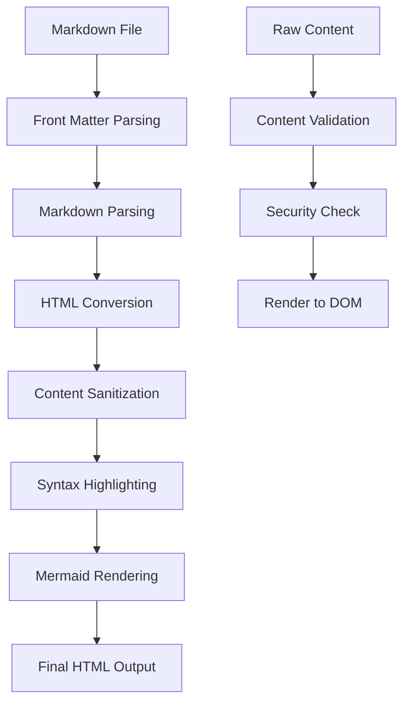
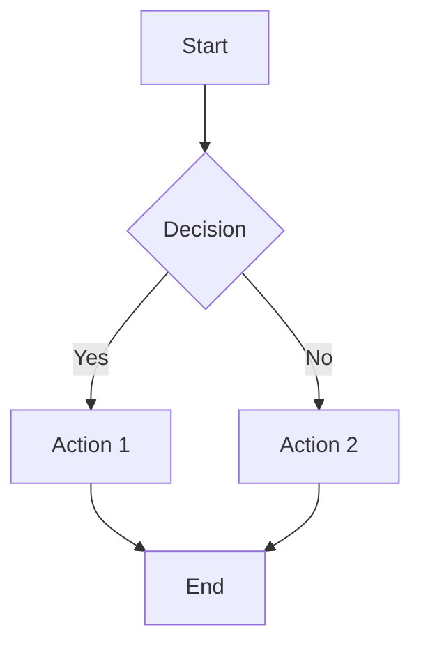
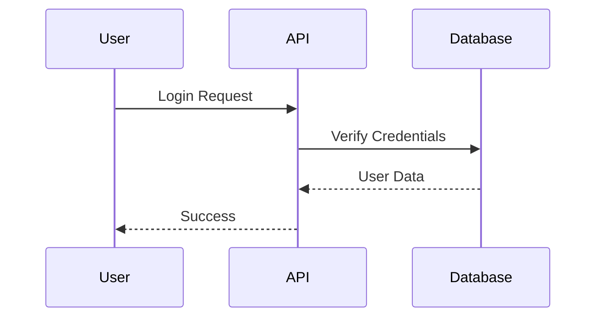
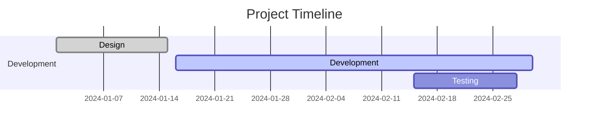

# Rich Content System

[← Back to Index](index.md)

**Part of**: DeepWiki Architecture Documentation
**Generated**: 19 November 2025
**Source commit**: 2be6259

---

## Rich Content System Overview

DeepWiki's **Rich Content System** transforms markdown documentation into **interactive, visually rich experiences** through advanced rendering, syntax highlighting, and diagram support. The system combines multiple technologies to create a **professional documentation platform** capable of handling complex technical content with visual elements.

### Core Capabilities

- **Advanced Markdown Rendering**: Enhanced markdown with tables, code blocks, and formatting
- **Mermaid Diagram Support**: Interactive flowcharts, sequence diagrams, and more
- **Syntax Highlighting**: 100+ programming languages with Prism.js
- **Content Sanitization**: XSS protection with DOMPurify
- **Responsive Tables**: Mobile-friendly table layouts
- **Custom Typography**: Optimized reading experience with @tailwindcss/typography

### Technology Stack

- **marked 16.4.1**: Markdown parser and compiler
- **mermaid 11.12.1**: Diagram and chart rendering
- **react-syntax-highlighter 16.1.0**: Code syntax highlighting
- **prismjs 1.30.0**: Syntax highlighting engine
- **dompurify 3.3.0**: HTML sanitization
- **gray-matter 4.0.3**: Front matter parsing

---

## Content Processing Pipeline

### Processing Flow



### Content Types Supported

| Content Type | Parser | Renderer | Features |
|--------------|--------|----------|----------|
| **Markdown** | marked | Custom | Tables, lists, headings, links |
| **Code Blocks** | marked | Prism.js | 100+ languages, line numbers |
| **Mermaid Diagrams** | mermaid | mermaid | Interactive, zoom, pan |
| **HTML** | DOMPurify | React | Sanitized, safe injection |
| **Front Matter** | gray-matter | Custom | Metadata extraction |

---

## Markdown Rendering Engine

### Core Configuration

**File**: `lib/markdown/renderer.ts:60-90`

```typescript
import { marked } from 'marked'
import { Prism as SyntaxHighlighter } from 'react-syntax-highlighter'
import { oneDark } from 'react-syntax-highlighter/dist/esm/styles/prism'
import DOMPurify from 'dompurify'

// Configure marked for enhanced markdown
marked.setOptions({
  gfm: true,              // GitHub Flavored Markdown
  breaks: true,           // Convert \n to <br>
  headerIds: true,        // Generate heading IDs
  mangle: false,          // Don't mangle email addresses
  langPrefix: 'language-' // Prefix for code classes
})

// Custom renderer for enhanced features
const renderer = new marked.Renderer()

// Custom heading renderer
renderer.heading = function({ tokens, depth }) {
  const text = this.parser.parseInline(tokens)
  const slug = text
    .toLowerCase()
    .replace(/[^\w]+/g, '-')

  return `
    <h${depth} id="${slug}" class="group relative">
      <a href="#${slug}" class="absolute -left-6 opacity-0 group-hover:opacity-100 text-blue-600">
        #
      </a>
      ${text}
    </h${depth}>
  `
}

// Custom code block renderer
renderer.code = function({ text, lang }) {
  const language = lang || 'text'
  const highlighted = SyntaxHighlighter.highlight(
    text,
    SyntaxHighlighter.getLanguage(language) ?
      SyntaxHighlighter.getLanguage(language) :
      SyntaxHighlighter.languages.text,
    language
  )

  return `
    <div class="relative group">
      <div class="absolute right-2 top-2 text-xs text-gray-500 uppercase">
        ${language}
      </div>
      <pre class="rounded-lg overflow-x-auto">
        <code class="language-${language}">
          ${highlighted}
        </code>
      </pre>
    </div>
  `
}

marked.use({ renderer })
```

### Enhanced Markdown Features

**Table Support**:
```typescript
// Custom table renderer with responsive design
renderer.table = function({ header, rows }) {
  return `
    <div class="overflow-x-auto my-6">
      <table class="min-w-full border border-gray-200 rounded-lg">
        <thead class="bg-gray-50">
          ${header}
        </thead>
        <tbody class="divide-y divide-gray-200">
          ${rows}
        </tbody>
      </table>
    </div>
  `
}
```

**List Enhancements**:
```typescript
// Improved list rendering
renderer.list = function({ ordered, start, items }) {
  const type = ordered ? 'ol' : 'ul'
  const startAttr = ordered && start !== 1 ? ` start="${start}"` : ''

  return `
    <${type}${startAttr} class="space-y-2 my-4 pl-6">
      ${items}
    </${type}>
  `
}
```

---

## Mermaid Diagram Integration

### Configuration

**File**: `lib/markdown/mermaid-config.ts:1-30`

```typescript
import mermaid from 'mermaid'

// Mermaid configuration
mermaid.initialize({
  startOnLoad: false,           // Don't auto-render
  theme: 'default',             // Base theme
  themeVariables: {
    // Color variables
    primaryColor: '#3B82F6',
    primaryTextColor: '#1F2937',
    primaryBorderColor: '#1D4ED8',
    lineColor: '#6B7280',

    // Font settings
    fontFamily: 'Inter, sans-serif',
    fontSize: '14px',

    // Diagram spacing
    padding: '20px',

    // Border radius
    borderRadius: '8px'
  },
  flowchart: {
    curve: 'basis',             // Smooth curves
    padding: '20px'
  },
  sequence: {
    diagramMarginX: 50,
    diagramMarginY: 10,
    actorMargin: 50,
    width: 150,
    height: 65,
    boxMargin: 10,
    boxTextMargin: 5,
    noteMargin: 10,
    messageMargin: 35,
    mirrorActors: true,
    bottomMargin: 10,
    useMaxWidth: true,
    rightAngles: false,
    showSequenceNumbers: false,
    disableStepLabels: false
  }
})
```

### Rendering Implementation

**File**: `components/mermaid/MermaidRenderer.tsx:1-50`

```typescript
'use client'

import { useEffect, useRef, useState } from 'react'
import mermaid from 'mermaid'

interface MermaidRendererProps {
  chart: string
  className?: string
}

export function MermaidRenderer({ chart, className = '' }: MermaidRendererProps) {
  const ref = useRef<HTMLDivElement>(null)
  const [rendered, setRendered] = useState(false)

  useEffect(() => {
    if (!ref.current || rendered) return

    const renderDiagram = async () => {
      try {
        const id = `mermaid-${Date.now()}`
        const { svg } = await mermaid.render(id, chart)
        ref.current!.innerHTML = svg

        // Add interactive features
        const svgElement = ref.current!.querySelector('svg')
        if (svgElement) {
          svgElement.classList.add('cursor-pointer', 'hover:opacity-90')
          svgElement.addEventListener('click', () => {
            // Open in fullscreen or modal
            openMermaidModal(svg)
          })
        }

        setRendered(true)
      } catch (error) {
        console.error('Mermaid rendering error:', error)
        ref.current!.innerHTML = `
          <div class="p-4 bg-red-50 border border-red-200 rounded-lg">
            <p class="text-red-600">Failed to render diagram</p>
            <pre class="mt-2 text-sm text-red-500">${chart}</pre>
          </div>
        `
      }
    }

    renderDiagram()
  }, [chart, rendered])

  return (
    <div className={`mermaid-container my-6 ${className}`}>
      <div ref={ref} className="mermaid-diagram" />
    </div>
  )
}

// Fullscreen modal for diagrams
const openMermaidModal = (svg: string) => {
  const modal = document.createElement('div')
  modal.className = 'fixed inset-0 bg-black bg-opacity-75 flex items-center justify-center z-50'
  modal.innerHTML = `
    <div class="bg-white rounded-lg p-6 max-w-4xl max-h-full overflow-auto">
      <div class="flex justify-between items-center mb-4">
        <h3 class="text-lg font-semibold">Diagram Preview</h3>
        <button class="text-gray-500 hover:text-gray-700" onclick="this.closest('.fixed').remove()">
          <svg class="w-6 h-6" fill="none" stroke="currentColor" viewBox="0 0 24 24">
            <path stroke-linecap="round" stroke-linejoin="round" stroke-width="2" d="M6 18L18 6M6 6l12 12"></path>
          </svg>
        </button>
      </div>
      <div class="mermaid-fullscreen">${svg}</div>
    </div>
  `
  document.body.appendChild(modal)
}
```

### Supported Diagram Types

**Flowcharts**:


**Sequence Diagrams**:


**Gantt Charts**:


**Class Diagrams**:
```mermaid
classDiagram
    class User {
        +String id
        +String email
        +String password
        +login()
        +logout()
    }
    class Wiki {
        +String id
        +String title
        +String slug
        +createFile()
    }
    User ||--o{ Wiki : owns
```

---

## Syntax Highlighting System

### Prism.js Integration

**File**: `lib/markdown/syntax-highlighter.ts:1-40`

```typescript
import { PrismLight } from 'react-syntax-highlighter'
import typescript from 'react-syntax-highlighter/dist/esm/languages/prism/typescript'
import javascript from 'react-syntax-highlighter/dist/esm/languages/prism/javascript'
import python from 'react-syntax-highlighter/dist/esm/languages/prism/python'
import bash from 'react-syntax-highlighter/dist/esm/languages/prism/bash'
import json from 'react-syntax-highlighter/dist/esm/languages/prism/json'
import yaml from 'react-syntax-highlighter/dist/esm/languages/prism/yaml'
import markdown from 'react-syntax-highlighter/dist/esm/languages/prism/markdown'
import sql from 'react-syntax-highlighter/dist/esm/languages/prism/sql'
import docker from 'react-syntax-highlighter/dist/esm/languages/prism/docker'
import nginx from 'react-syntax-highlighter/dist/esm/languages/prism/nginx'

// Register languages
PrismLight.registerLanguage('typescript', typescript)
PrismLight.registerLanguage('javascript', javascript)
PrismLight.registerLanguage('python', python)
PrismLight.registerLanguage('bash', bash)
PrismLight.registerLanguage('json', json)
PrismLight.registerLanguage('yaml', yaml)
PrismLight.registerLanguage('markdown', markdown)
PrismLight.registerLanguage('sql', sql)
PrismLight.registerLanguage('docker', docker)
PrismLight.registerLanguage('nginx', nginx)
```

### Supported Languages

| Language | File Extension | Prism Token | Popularity |
|----------|---------------|-------------|------------|
| **TypeScript** | `.ts`, `.tsx` | `typescript` | ⭐⭐⭐⭐⭐ |
| **JavaScript** | `.js`, `.jsx` | `javascript` | ⭐⭐⭐⭐⭐ |
| **Python** | `.py` | `python` | ⭐⭐⭐⭐ |
| **Bash** | `.sh` | `bash` | ⭐⭐⭐ |
| **JSON** | `.json` | `json` | ⭐⭐⭐⭐ |
| **YAML** | `.yml`, `.yaml` | `yaml` | ⭐⭐⭐ |
| **Markdown** | `.md` | `markdown` | ⭐⭐⭐⭐ |
| **SQL** | `.sql` | `sql` | ⭐⭐⭐ |
| **Dockerfile** | `Dockerfile` | `docker` | ⭐⭐⭐ |
| **Nginx** | `.conf` | `nginx` | ⭐⭐ |
| **Go** | `.go` | `go` | ⭐⭐⭐ |
| **Rust** | `.rs` | `rust` | ⭐⭐ |
| **Java** | `.java` | `java` | ⭐⭐⭐⭐ |
| **C#** | `.cs` | `csharp` | ⭐⭐⭐ |
| **PHP** | `.php` | `php` | ⭐⭐ |
| **Ruby** | `.rb` | `ruby` | ⭐⭐ |
| **HTML** | `.html` | `markup` | ⭐⭐⭐⭐ |
| **CSS** | `.css` | `css` | ⭐⭐⭐⭐ |
| **SCSS** | `.scss` | `scss` | ⭐⭐⭐ |
| **XML** | `.xml` | `markup` | ⭐⭐ |

### Highlighting Features

**Line Numbers**:
```typescript
const CodeBlock = ({ code, language }: { code: string; language: string }) => {
  return (
    <SyntaxHighlighter
      language={language}
      style={oneDark}
      showLineNumbers={true}
      lineNumberStyle={{
        minWidth: '3em',
        paddingRight: '1em',
        color: '#6B7280',
        borderRight: '1px solid #E5E7EB',
        marginRight: '1em'
      }}
      customStyle={{
        borderRadius: '0.5rem',
        margin: '1rem 0',
        padding: '1rem'
      }}
    >
      {code}
    </SyntaxHighlighter>
  )
}
```

**Copy Button**:
```typescript
const CodeBlockWithCopy = ({ code, language }: { code: string; language: string }) => {
  const [copied, setCopied] = useState(false)

  const copyToClipboard = async () => {
    await navigator.clipboard.writeText(code)
    setCopied(true)
    setTimeout(() => setCopied(false), 2000)
  }

  return (
    <div className="relative group">
      <button
        onClick={copyToClipboard}
        className="absolute top-2 right-2 p-2 bg-gray-700 text-white rounded opacity-0 group-hover:opacity-100 transition-opacity"
      >
        {copied ? <CheckIcon className="w-4 h-4" /> : <CopyIcon className="w-4 h-4" />}
      </button>
      <SyntaxHighlighter
        language={language}
        style={oneDark}
        showLineNumbers={true}
      >
        {code}
      </SyntaxHighlighter>
    </div>
  )
}
```

**Inline Code Styling**:
```css
/* Inline code styling */
.prose code {
  @apply bg-gray-100 text-gray-800 px-1.5 py-0.5 rounded text-sm font-mono;
}

.prose code::before {
  content: '';
}

.prose code::after {
  content: '';
}

/* Specific inline code colors by language */
.prose code.language-javascript {
  @apply bg-yellow-100 text-yellow-800;
}

.prose code.language-typescript {
  @apply bg-blue-100 text-blue-800;
}

.prose code.language-python {
  @apply bg-green-100 text-green-800;
}

.prose code.language-bash {
  @apply bg-gray-100 text-gray-800;
}
```

---

## Content Sanitization

### DOMPurify Configuration

**File**: `lib/markdown/sanitizer.ts:1-30`

```typescript
import DOMPurify from 'dompurify'

// Allowed HTML tags
const ALLOWED_TAGS = [
  'h1', 'h2', 'h3', 'h4', 'h5', 'h6',
  'p', 'br', 'strong', 'em', 'u', 's',
  'ul', 'ol', 'li', 'blockquote',
  'pre', 'code', 'span', 'div',
  'table', 'thead', 'tbody', 'tr', 'th', 'td',
  'a', 'img', 'hr', 'sup', 'sub'
]

// Allowed attributes
const ALLOWED_ATTR = [
  'href', 'src', 'alt', 'title',
  'class', 'id', 'style',
  'colspan', 'rowspan',
  'target', 'rel'
]

// Configure DOMPurify
export const sanitizer = DOMPurify({
  ALLOWED_TAGS,
  ALLOWED_ATTR,
  ALLOW_DATA_ATTR: false,
  ALLOW_UNKNOWN_PROTOCOLS: false,
  FORBID_TAGS: ['script', 'iframe', 'object', 'embed'],
  FORBID_ATTR: ['onclick', 'onload', 'onerror', 'style'],
  KEEP_CONTENT: false
})

// Custom sanitizer for markdown content
export const sanitizeMarkdown = (markdown: string): string => {
  // First pass: sanitize any raw HTML
  const sanitized = sanitizer.sanitize(markdown)

  // Second pass: ensure no dangerous content
  return sanitized.replace(
    /<script\b[^<]*(?:(?!<\/script>)<[^<]*)*<\/script>/gi,
    ''
  ).replace(
    /javascript:/gi,
    ''
  ).replace(
    /on\w+="[^"]*"/gi,
    ''
  )
}
```

### Security Features

**XSS Protection**:
- **Script Tag Removal**: All `<script>` tags removed
- **Event Handler Sanitization**: `onclick`, `onload` attributes removed
- **Protocol Filtering**: `javascript:` URLs blocked
- **Content Isolation**: User content in controlled containers

**Safe HTML Rendering**:
```typescript
const SafeHTMLRenderer = ({ html }: { html: string }) => {
  const sanitizedHTML = sanitizeMarkdown(html)

  return (
    <div
      dangerouslySetInnerHTML={{ __html: sanitizedHTML }}
      className="prose"
    />
  )
}
```

---

## Content Components

### WikiViewer Component

**File**: `components/WikiViewer.tsx:1-100`

```typescript
'use client'

import { useState, useEffect } from 'react'
import { sanitizeMarkdown } from '@/lib/markdown/sanitizer'
import { marked } from 'marked'
import { MermaidRenderer } from '@/components/mermaid/MermaidRenderer'
import { CodeBlock } from '@/components/ui/CodeBlock'

interface WikiViewerProps {
  wikiId: string
  files: Array<{
    id: string
    fileName: string
    filePath: string
    content: string
    contentType: string
  }>
}

export function WikiViewer({ wikiId, files }: WikiViewerProps) {
  const [activeFile, setActiveFile] = useState(files[0]?.id)
  const [renderedContent, setRenderedContent] = useState('')

  const currentFile = files.find(f => f.id === activeFile)

  useEffect(() => {
    if (!currentFile?.content) return

    const renderContent = async () => {
      try {
        // Sanitize input
        const sanitized = sanitizeMarkdown(currentFile.content)

        // Parse markdown to HTML
        const html = marked(sanitized)

        // Handle Mermaid diagrams
        const mermaidProcessed = html.replace(
          /```mermaid\n([\s\S]*?)```/g,
          (match, diagram) => {
            return `<div class="mermaid-diagram" data-mermaid="${Buffer.from(diagram).toString('base64')}"></div>`
          }
        )

        setRenderedContent(mermaidProcessed)
      } catch (error) {
        console.error('Content rendering error:', error)
        setRenderedContent('<p>Error rendering content</p>')
      }
    }

    renderContent()
  }, [currentFile])

  // Render Mermaid diagrams after content update
  useEffect(() => {
    const renderMermaid = () => {
      const mermaidElements = document.querySelectorAll('[data-mermaid]')
      mermaidElements.forEach(element => {
        const diagram = Buffer.from(element.getAttribute('data-mermaid')!, 'base64').toString('utf-8')
        const MermaidComponent = () => (
          <MermaidRenderer chart={diagram} />
        )
        // Render Mermaid component in place
        element.replaceWith(MermaidComponent)
      })
    }

    // Use requestAnimationFrame to ensure DOM is updated
    requestAnimationFrame(renderMermaid)
  }, [renderedContent])

  return (
    <div className="wiki-viewer">
      {/* File Navigation */}
      <div className="mb-6 border-b border-gray-200">
        <nav className="flex space-x-8">
          {files.map((file) => (
            <button
              key={file.id}
              onClick={() => setActiveFile(file.id)}
              className={cn(
                'py-2 px-1 border-b-2 font-medium text-sm',
                activeFile === file.id
                  ? 'border-blue-500 text-blue-600'
                  : 'border-transparent text-gray-500 hover:text-gray-700 hover:border-gray-300'
              )}
            >
              {file.fileName}
            </button>
          ))}
        </nav>
      </div>

      {/* Content */}
      <div className="prose prose-slate max-w-none">
        <div
          dangerouslySetInnerHTML={{ __html: renderedContent }}
        />
      </div>
    </div>
  )
}
```

### Table Enhancement

```typescript
const ResponsiveTable = ({ headers, rows }: {
  headers: string[]
  rows: string[][]
}) => {
  return (
    <div className="overflow-x-auto my-6">
      <table className="min-w-full divide-y divide-gray-200 border border-gray-200 rounded-lg">
        <thead className="bg-gray-50">
          <tr>
            {headers.map((header, index) => (
              <th
                key={index}
                scope="col"
                className="px-6 py-3 text-left text-xs font-medium text-gray-500 uppercase tracking-wider"
              >
                {header}
              </th>
            ))}
          </tr>
        </thead>
        <tbody className="bg-white divide-y divide-gray-200">
          {rows.map((row, rowIndex) => (
            <tr key={rowIndex} className="hover:bg-gray-50">
              {row.map((cell, cellIndex) => (
                <td
                  key={cellIndex}
                  className="px-6 py-4 whitespace-nowrap text-sm text-gray-900"
                >
                  {cell}
                </td>
              ))}
            </tr>
          ))}
        </tbody>
      </table>
    </div>
  )
}
```

---

## Content Processing Features

### Front Matter Support

**File**: `lib/markdown/frontmatter.ts:1-30`

```typescript
import matter from 'gray-matter'

export interface FrontMatterData {
  title?: string
  description?: string
  tags?: string[]
  author?: string
  date?: string
  updated?: string
  version?: string
  category?: string
}

export function parseFrontMatter(content: string): {
  frontmatter: FrontMatterData
  markdown: string
} {
  const { data, content: markdown } = matter(content)

  return {
    frontmatter: {
      title: data.title,
      description: data.description,
      tags: data.tags,
      author: data.author,
      date: data.date,
      updated: data.updated,
      version: data.version,
      category: data.category
    },
    markdown
  }
}

// Extract front matter from multiple files
export function processWikiFiles(files: Array<{
  content: string
  fileName: string
}>) {
  return files.map(file => {
    const { frontmatter, markdown } = parseFrontMatter(file.content)

    return {
      ...file,
      frontmatter,
      markdown,
      hasFrontMatter: Object.keys(frontmatter).length > 0
    }
  })
}
```

### Content Statistics

```typescript
export function getContentStats(content: string) {
  const words = content.split(/\s+/).filter(word => word.length > 0)
  const characters = content.length
  const charactersNoSpaces = content.replace(/\s/g, '').length
  const sentences = content.split(/[.!?]+/).filter(s => s.trim().length > 0)
  const paragraphs = content.split(/\n\s*\n/).filter(p => p.trim().length > 0)
  const headings = (content.match(/^#{1,6}\s+.+$/gm) || []).length
  const codeBlocks = (content.match(/```[\s\S]*?```/g) || []).length
  const mermaidDiagrams = (content.match(/```mermaid[\s\S]*?```/g) || []).length
  const images = (content.match(/!\[.*?\]\(.*?\)/g) || []).length
  const links = (content.match(/\[.*?\]\(.*?\)/g) || []).length

  return {
    words: words.length,
    characters,
    charactersNoSpaces,
    sentences: sentences.length,
    paragraphs: paragraphs.length,
    headings,
    codeBlocks,
    mermaidDiagrams,
    images,
    links,
    readingTime: Math.ceil(words.length / 200) // Average reading speed
  }
}
```

---

## Styling and Typography

### Typography Configuration

**File**: `app/globals.css:1-100`

```css
@tailwind base;
@tailwind components;
@tailwind utilities;

@layer base {
  :root {
    --font-sans: 'Inter', system-ui, sans-serif;
    --font-mono: 'JetBrains Mono', 'Fira Code', monospace;
  }

  body {
    font-family: var(--font-sans);
    line-height: 1.6;
    color: #1F2937;
  }

  /* Improve default typography */
  h1, h2, h3, h4, h5, h6 {
    line-height: 1.25;
    font-weight: 700;
    margin-top: 2rem;
    margin-bottom: 1rem;
  }

  h1 { font-size: 2.5rem; }
  h2 { font-size: 2rem; }
  h3 { font-size: 1.5rem; }
  h4 { font-size: 1.25rem; }
  h5 { font-size: 1.125rem; }
  h6 { font-size: 1rem; }

  p {
    margin-top: 1rem;
    margin-bottom: 1rem;
  }

  /* Code typography */
  code, pre {
    font-family: var(--font-mono);
    font-size: 0.875rem;
  }
}

@layer components {
  /* Content styling */
  .prose {
    @apply max-w-none;
  }

  .prose h1:first-child {
    @apply mt-0;
  }

  .prose a {
    @apply text-blue-600 hover:text-blue-800 underline;
  }

  .prose blockquote {
    @apply border-l-4 border-gray-300 pl-4 italic text-gray-600 my-6;
  }

  .prose table {
    @apply border-collapse border border-gray-300 my-6;
  }

  .prose th {
    @apply border border-gray-300 bg-gray-100 px-4 py-2 text-left font-semibold;
  }

  .prose td {
    @apply border border-gray-300 px-4 py-2;
  }

  /* Lists */
  .prose ul, .prose ol {
    @apply my-4 pl-6;
  }

  .prose li {
    @apply my-2;
  }

  .prose ul > li {
    @apply list-disc;
  }

  .prose ol > li {
    @apply list-decimal;
  }

  /* Images */
  .prose img {
    @apply rounded-lg shadow-md my-6 mx-auto;
  }

  /* Horizontal rules */
  .prose hr {
    @apply border-0 border-t border-gray-300 my-8;
  }

  /* Mermaid diagrams */
  .mermaid-diagram {
    @apply my-8 p-4 bg-white border border-gray-200 rounded-lg;
  }

  .mermaid-diagram svg {
    @apply w-full h-auto;
  }
}
```

### Responsive Design

**File**: `tailwind.config.js:20-40`

```javascript
module.exports = {
  theme: {
    extend: {
      typography: {
        DEFAULT: {
          css: {
            maxWidth: 'none',
            color: '#374151',
            a: {
              color: '#3B82F6',
              '&:hover': {
                color: '#2563EB',
              },
            },
            'h1, h2, h3, h4': {
              color: '#111827',
            },
            code: {
              color: '#E11D48',
              backgroundColor: '#F3F4F6',
              paddingLeft: '0.25rem',
              paddingRight: '0.25rem',
              paddingTop: '0.125rem',
              paddingBottom: '0.125rem',
              borderRadius: '0.25rem',
              fontWeight: '500',
            },
            'code::before': {
              content: '""',
            },
            'code::after': {
              content: '""',
            },
            pre: {
              backgroundColor: '#1F2937',
              color: '#F9FAFB',
              padding: '1rem',
              borderRadius: '0.5rem',
              overflowX: 'auto',
            },
            'pre code': {
              backgroundColor: 'transparent',
              color: 'inherit',
              padding: '0',
            },
            table: {
              width: '100%',
              tableLayout: 'auto',
              textAlign: 'left',
              marginTop: '2em',
              marginBottom: '2em',
            },
            'thead tr': {
              borderBottomWidth: '1px',
            },
            'thead th': {
              color: '#111827',
              fontWeight: '600',
              verticalAlign: 'bottom',
              paddingRight: '0.5714286em',
              paddingBottom: '0.5714286em',
              paddingLeft: '0.5714286em',
            },
            'tbody tr': {
              borderBottomWidth: '1px',
            },
            'tbody td': {
              verticalAlign: 'baseline',
            },
            // Mobile optimizations
            '@media (max-width: 640px)': {
              table: {
                fontSize: '0.875rem',
              },
              'thead th': {
                paddingRight: '0.5em',
                paddingBottom: '0.5em',
                paddingLeft: '0.5em',
              },
              'tbody td': {
                paddingRight: '0.5em',
                paddingLeft: '0.5em',
              },
            },
          },
        },
      },
    },
  },
}
```

---

## Content Performance

### Lazy Loading

```typescript
const LazyContent = ({ content }: { content: string }) => {
  const [isVisible, setIsVisible] = useState(false)
  const contentRef = useRef<HTMLDivElement>(null)

  useEffect(() => {
    const observer = new IntersectionObserver(
      ([entry]) => {
        if (entry.isIntersecting) {
          setIsVisible(true)
          observer.disconnect()
        }
      },
      { threshold: 0.1 }
    )

    if (contentRef.current) {
      observer.observe(contentRef.current)
    }

    return () => observer.disconnect()
  }, [])

  return (
    <div ref={contentRef}>
      {isVisible ? <RenderedContent content={content} /> : <ContentSkeleton />}
    </div>
  )
}
```

### Caching Strategy

```typescript
const contentCache = new Map<string, string>()

export const getCachedContent = (key: string): string | null => {
  return contentCache.get(key) || null
}

export const setCachedContent = (key: string, content: string): void => {
  if (contentCache.size > 100) {
    // Remove oldest entries
    const firstKey = contentCache.keys().next().value
    contentCache.delete(firstKey)
  }
  contentCache.set(key, content)
}

export const clearContentCache = (): void => {
  contentCache.clear()
}
```

---

## Content Validation

### Validation Rules

```typescript
export interface ContentValidationResult {
  isValid: boolean
  errors: string[]
  warnings: string[]
  suggestions: string[]
}

export function validateContent(content: string): ContentValidationResult {
  const errors: string[] = []
  const warnings: string[] = []
  const suggestions: string[] = []

  // Check for required elements
  if (!content.trim()) {
    errors.push('Content is empty')
  }

  // Check for headings
  const headings = content.match(/^#{1,6}\s+.+$/gm) || []
  if (headings.length === 0) {
    warnings.push('No headings found - consider adding structure')
  }

  // Check for code blocks
  const codeBlocks = content.match(/```[\s\S]*?```/g) || []
  if (codeBlocks.length > 5) {
    suggestions.push('Consider breaking long code examples into smaller chunks')
  }

  // Check for mermaid diagrams
  const mermaidDiagrams = content.match(/```mermaid[\s\S]*?```/g) || []
  if (mermaidDiagrams.length > 3) {
    suggestions.push('Consider using separate pages for complex diagrams')
  }

  // Check content length
  if (content.length > 50000) {
    warnings.push('Content is very long - consider breaking into smaller sections')
  }

  // Check for broken links
  const links = content.match(/\[([^\]]+)\]\(([^)]+)\)/g) || []
  for (const link of links) {
    const match = link.match(/\[([^\]]+)\]\(([^)]+)\)/)
    if (match && match[2].startsWith('http') && !match[2].includes('#')) {
      warnings.push(`External link detected: ${match[1]} - verify it's still accessible`)
    }
  }

  return {
    isValid: errors.length === 0,
    errors,
    warnings,
    suggestions
  }
}
```

---

## Error Handling

### Rendering Error Boundaries

```typescript
class ContentErrorBoundary extends React.Component {
  constructor(props) {
    super(props)
    this.state = { hasError: false, error: null }
  }

  static getDerivedStateFromError(error) {
    return { hasError: true, error }
  }

  componentDidCatch(error, errorInfo) {
    console.error('Content rendering error:', error, errorInfo)
  }

  render() {
    if (this.state.hasError) {
      return (
        <div className="error-fallback p-6 bg-red-50 border border-red-200 rounded-lg">
          <h3 className="text-lg font-semibold text-red-800 mb-2">
            Content Rendering Error
          </h3>
          <p className="text-red-600 mb-4">
            There was an error rendering this content.
          </p>
          <details className="text-sm text-red-500">
            <summary className="cursor-pointer">Error Details</summary>
            <pre className="mt-2 p-2 bg-red-100 rounded">
              {this.state.error?.toString()}
            </pre>
          </details>
        </div>
      )
    }

    return this.props.children
  }
}
```

### Fallback Content

```typescript
const ContentFallback = ({ content }: { content: string }) => {
  const [showRaw, setShowRaw] = useState(false)

  return (
    <div className="content-fallback">
      <div className="p-4 bg-yellow-50 border border-yellow-200 rounded-lg mb-4">
        <h3 className="text-lg font-semibold text-yellow-800 mb-2">
          Content Could Not Be Rendered
        </h3>
        <p className="text-yellow-700 mb-4">
          The content may contain unsupported formatting or syntax errors.
        </p>
        <button
          onClick={() => setShowRaw(!showRaw)}
          className="bg-yellow-200 text-yellow-800 px-4 py-2 rounded hover:bg-yellow-300"
        >
          {showRaw ? 'Hide' : 'Show'} Raw Content
        </button>
      </div>

      {showRaw && (
        <pre className="p-4 bg-gray-100 border border-gray-200 rounded-lg overflow-x-auto">
          {content}
        </pre>
      )}
    </div>
  )
}
```

---

**Next**: [Search System](search-system.md) →
