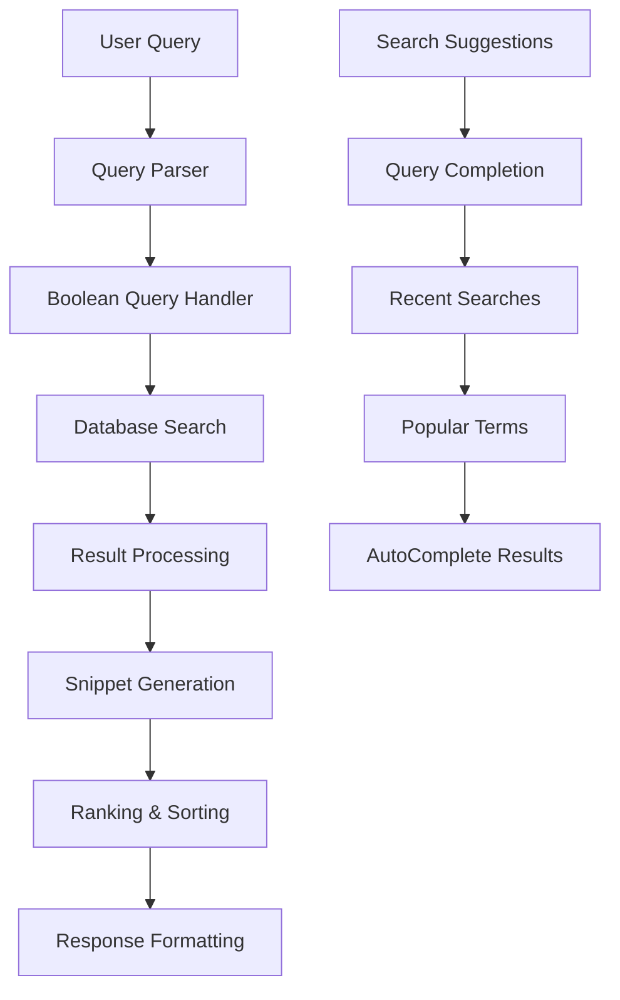

# Search System

[← Back to Index](index.md)

**Part of**: DeepWiki Architecture Documentation
**Generated**: 19 November 2025
**Source commit**: 2be6259

---

## Search System Overview

DeepWiki implements a **comprehensive full-text search system** capable of searching across wiki titles, descriptions, file content, and metadata. The system supports **boolean queries**, **exact phrase matching**, **content filtering**, and **real-time suggestions** - providing users with powerful tools to quickly find relevant documentation.

### Core Capabilities

- **Full-Text Search**: Search across all wiki content and metadata
- **Boolean Query Support**: AND, OR, NOT operators
- **Exact Phrase Matching**: Quoted string searches
- **Content Filtering**: Filter by file type, date range
- **Real-Time Suggestions**: Autocomplete with search results
- **Snippet Generation**: Contextual results with highlighting
- **Performance Optimization**: Indexed queries and caching

### Search Architecture



---

## Search Implementation

### Query Parser

**File**: `app/api/wiki/search/route.ts:25-55`

The search system includes a sophisticated query parser that handles boolean logic:

```typescript
function parseBooleanQuery(query: string): {
  includeTerms: string[]
  excludeTerms: string[]
  exactPhrases: string[]
} {
  const includeTerms: string[] = []
  const excludeTerms: string[] = []
  const exactPhrases: string[] = []

  // Extract exact phrases in quotes
  const phraseRegex = /"([^"]+)"/g
  let match
  while ((match = phraseRegex.exec(query)) !== null) {
    exactPhrases.push(match[1])
  }

  // Remove phrases from query and split remaining terms
  let cleanQuery = query.replace(/"[^"]+"/g, '').trim()
  const terms = cleanQuery.split(/\s+/)

  terms.forEach(term => {
    if (term.toUpperCase() === 'NOT' && includeTerms.length > 0) {
      // Move the last term to exclude
      excludeTerms.push(includeTerms.pop()!)
    } else if (!term.toUpperCase().match(/^(AND|OR|NOT)$/)) {
      includeTerms.push(term)
    }
  })

  return { includeTerms, excludeTerms, exactPhrases }
}
```

**Query Parsing Features**:
- **Exact Phrases**: `"docker container"` matches exact phrase
- **Boolean Logic**: `docker AND kubernetes NOT tutorial`
- **Default Behavior**: Terms are implicitly ANDed together
- **Case Insensitive**: All matching is case-insensitive

### Search Algorithms

**File**: `app/api/wiki/search/route.ts:57-88`

```typescript
function createContentFilter(terms: string[]) {
  if (terms.length === 0) return {}

  return {
    OR: terms.map(term => ({
      content: {
        contains: term
      }
    }))
  }
}

function createSnippet(content: string, query: string, maxLength: number = 300): string {
  const queryLower = query.toLowerCase()
  const contentLower = content.toLowerCase()
  const index = contentLower.indexOf(queryLower)

  if (index === -1) {
    return content.substring(0, maxLength) + (content.length > maxLength ? '...' : '')
  }

  // Extract context around the match
  const start = Math.max(0, index - 50)
  const end = Math.min(content.length, index + query.length + 150)

  let snippet = content.substring(start, end)
  if (start > 0) snippet = '...' + snippet
  if (end < content.length) snippet = snippet + '...'

  // Highlight the query term
  const regex = new RegExp(`(${query})`, 'gi')
  snippet = snippet.replace(regex, '<mark>$1</mark>')

  return snippet
}
```

**Search Features**:
- **Content Matching**: Full-text search in file content
- **Contextual Snippets**: Extract relevant text around matches
- **Highlighting**: Mark query terms in results
- **Truncation**: Smart truncation with ellipsis

---

## Search Endpoints

### Full-Text Search

**Endpoint**: `GET /api/wiki/search`
**File**: `app/api/wiki/search/route.ts:90-268`

```typescript
export async function GET(request: NextRequest) {
  try {
    const { searchParams } = new URL(request.url)
    const query = searchParams.get('q')
    const content = searchParams.get('content') === 'true'
    const highlight = searchParams.get('highlight') === 'true'
    const fromDate = searchParams.get('fromDate')
    const toDate = searchParams.get('toDate')
    const fileType = searchParams.get('fileType')
    const limit = parseInt(searchParams.get('limit') || '20')

    if (!query || query.trim().length < 2) {
      return NextResponse.json({ success: true, results: [] })
    }

    // Parse boolean query
    const { includeTerms, excludeTerms, exactPhrases } = parseBooleanQuery(query)

    // Create base wiki filter
    const wikiFilter: any = {
      OR: [
        {
          title: {
            contains: query
          }
        },
        {
          description: {
            contains: query
          }
        }
      ]
    }

    // Add date range filter
    if (fromDate || toDate) {
      wikiFilter.updatedAt = {}
      if (fromDate) wikiFilter.updatedAt.gte = new Date(fromDate)
      if (toDate) wikiFilter.updatedAt.lte = new Date(toDate)
    }

    let results: SearchResult[] = []

    if (content) {
      // Search within file content
      const filesFilter: any = {}

      // Add content search
      if (includeTerms.length > 0 || exactPhrases.length > 0) {
        const contentFilter = []

        // Add include terms
        if (includeTerms.length > 0) {
          contentFilter.push(...includeTerms.map(term => ({
            content: { contains: term }
          })))
        }

        // Add exact phrases
        if (exactPhrases.length > 0) {
          contentFilter.push(...exactPhrases.map(phrase => ({
            content: { contains: phrase }
          })))
        }

        filesFilter.OR = contentFilter
      }

      // Add file type filter
      if (fileType) {
        filesFilter.contentType = {
          contains: fileType
        }
      }

      // Add exclude terms
      if (excludeTerms.length > 0) {
        filesFilter.AND = excludeTerms.map(term => ({
          NOT: {
            content: { contains: term }
          }
        }))
      }

      const files = await prisma.wikiFile.findMany({
        where: filesFilter,
        include: {
          wiki: {
            select: {
              id: true,
              title: true,
              slug: true,
              description: true,
              createdAt: true,
              updatedAt: true
            }
          }
        },
        take: limit
      })

      // Group files by wiki and create search results
      const wikiMap = new Map<string, SearchResult>()

      for (const file of files) {
        if (!wikiMap.has(file.wiki.id)) {
          wikiMap.set(file.wiki.id, {
            wiki: {
              ...file.wiki,
              createdAt: file.wiki.createdAt.toISOString(),
              updatedAt: file.wiki.updatedAt.toISOString(),
            },
            matches: []
          })
        }

        const result = wikiMap.get(file.wiki.id)!
        const snippet = highlight && file.content ? createSnippet(file.content, query) : undefined

        result.matches.push({
          file: {
            id: file.id,
            fileName: file.fileName,
            filePath: file.filePath,
            contentType: file.contentType
          },
          content: file.content || '',
          snippet
        })
      }

      results = Array.from(wikiMap.values())
    } else {
      // Traditional wiki metadata search
      const wikis = await prisma.wiki.findMany({
        where: wikiFilter,
        orderBy: [
          { updatedAt: 'desc' }
        ],
        take: limit,
        select: {
          id: true,
          title: true,
          slug: true,
          description: true,
          createdAt: true,
          updatedAt: true,
          _count: {
            select: {
              files: true
            }
          }
        }
      })

      results = wikis.map(wiki => ({
        wiki: {
          ...wiki,
          createdAt: wiki.createdAt.toISOString(),
          updatedAt: wiki.updatedAt.toISOString(),
        },
        matches: []
      }))
    }

    return NextResponse.json({
      success: true,
      results,
      total: results.length
    })

  } catch (error) {
    console.error('Advanced search error:', error)
    return NextResponse.json(
      { error: 'Failed to search wikis' },
      { status: 500 }
    )
  }
}
```

### Search Suggestions

**Endpoint**: `GET /api/wiki/search/suggestions`
**File**: `app/api/wiki/search/suggestions/route.ts:1-40`

```typescript
export async function GET(request: NextRequest) {
  try {
    const { searchParams } = new URL(request.url)
    const query = searchParams.get('q')
    const limit = parseInt(searchParams.get('limit') || '10')

    if (!query || query.trim().length < 2) {
      return NextResponse.json({ success: true, suggestions: [] })
    }

    // Search in wiki titles and file names
    const suggestions = await Promise.all([
      // Wiki title suggestions
      prisma.wiki.findMany({
        where: {
          OR: [
            { title: { contains: query, mode: 'insensitive' } },
            { description: { contains: query, mode: 'insensitive' } }
          ]
        },
        select: { title: true },
        take: Math.ceil(limit / 2)
      }),

      // File name suggestions
      prisma.wikiFile.findMany({
        where: {
          fileName: { contains: query, mode: 'insensitive' }
        },
        select: { fileName: true },
        take: Math.ceil(limit / 2)
      })
    ])

    const [wikiResults, fileResults] = suggestions

    const formattedSuggestions = [
      ...wikiResults.map(w => ({
        text: w.title,
        type: 'wiki' as const,
        count: 1
      })),
      ...fileResults.map(f => ({
        text: f.fileName,
        type: 'file' as const,
        count: 1
      }))
    ].slice(0, limit)

    return NextResponse.json({
      success: true,
      suggestions: formattedSuggestions
    })

  } catch (error) {
    console.error('Search suggestions error:', error)
    return NextResponse.json(
      { error: 'Failed to get search suggestions' },
      { status: 500 }
    )
  }
}
```

---

## Search Query Types

### 1. Simple Text Search

**Query**: `docker`
**Description**: Searches for "docker" in wiki titles, descriptions, and content

**SQL Equivalent**:
```sql
SELECT * FROM wikis
WHERE title ILIKE '%docker%'
   OR description ILIKE '%docker%'
```

### 2. Boolean Search

**Query**: `docker AND kubernetes`
**Description**: Results must contain both "docker" and "kubernetes"

**Query**: `docker OR container`
**Description**: Results can contain either "docker" or "container"

**Query**: `docker NOT tutorial`
**Description**: Results with "docker" but without "tutorial"

**Complex Query**: `docker AND kubernetes NOT tutorial OR setup`
**Description**: Results with docker and kubernetes, but not tutorial, or with setup

### 3. Exact Phrase Search

**Query**: `"docker containerization"`
**Description**: Searches for the exact phrase "docker containerization"

**Results**: Only exact matches for the phrase in quotes

### 4. Content Search

**Query**: `?content=true&q=authentication`
**Description**: Searches within file content, not just metadata

### 5. Filtered Search

**Query**: `?q=docker&fileType=markdown&fromDate=2024-01-01&toDate=2024-12-31`
**Description**: Filters by file type and date range

---

## Search Results Structure

### Search Response Format

**File**: `app/api/wiki/search/route.ts:4-23`

```typescript
interface SearchResult {
  wiki: {
    id: string
    title: string
    slug: string
    description: string | null
    createdAt: string
    updatedAt: string
  }
  matches: Array<{
    file: {
      id: string
      fileName: string
      filePath: string
      contentType: string
    }
    content: string
    snippet?: string
  }>
}
```

**Example Response**:
```json
{
  "success": true,
  "results": [
    {
      "wiki": {
        "id": "clp2k3m4f00001234567890ab",
        "title": "Docker Guide",
        "slug": "docker-guide",
        "description": "Complete guide to Docker",
        "createdAt": "2025-11-19T10:30:00.000Z",
        "updatedAt": "2025-11-19T10:35:00.000Z"
      },
      "matches": [
        {
          "file": {
            "id": "clp2k3m4f00001234567890cd",
            "fileName": "docker-basics.md",
            "filePath": "docker-guide/docker-basics.md",
            "contentType": "text/markdown"
          },
          "content": "Docker is a platform for developing, shipping, and running applications...",
          "snippet": "...Docker is a platform for developing, shipping, and running <mark>applications</mark> in containers..."
        }
      ]
    }
  ],
  "total": 1
}
```

### Result Types

| Result Type | Description | Fields |
|-------------|-------------|--------|
| **Wiki Match** | Match in wiki title/description | `wiki` with empty `matches` |
| **Content Match** | Match in file content | `wiki` with `matches` array |
| **Mixed Result** | Multiple matches across wiki | `wiki` with multiple `matches` |

---

## Search Performance

### Database Indexing

**File**: `prisma/schema.prisma:44-82`

The database schema includes strategic indexes for search performance:

```prisma
model WikiFile {
  // ... fields
  @@index([wikiId])           // Fast wiki lookups
  @@index([contentType])      // File type filtering
}

model WikiVersion {
  // ... fields
  @@index([wikiId])           // Version queries
  @@index([userId])           // User activity
}
```

**Index Strategy**:
- **Primary Keys**: All models have primary key indexes
- **Foreign Keys**: Indexed for JOIN performance
- **Search Fields**: Text fields for content search
- **Filtering Fields**: Date and type fields indexed

### Query Optimization

**Efficient Filtering**:
```typescript
// Use specific conditions first
const filesFilter: any = {}

// Add content search with OR conditions
if (includeTerms.length > 0 || exactPhrases.length > 0) {
  const contentFilter = []
  if (includeTerms.length > 0) {
    contentFilter.push(...includeTerms.map(term => ({
      content: { contains: term }
    })))
  }
  if (exactPhrases.length > 0) {
    contentFilter.push(...exactPhrases.map(phrase => ({
      content: { contains: phrase }
    })))
  }
  filesFilter.OR = contentFilter
}

// Add additional filters
if (fileType) {
  filesFilter.contentType = { contains: fileType }
}

if (excludeTerms.length > 0) {
  filesFilter.AND = excludeTerms.map(term => ({
    NOT: { content: { contains: term } }
  }))
}
```

**Pagination Strategy**:
```typescript
// Limit results to prevent performance issues
const files = await prisma.wikiFile.findMany({
  where: filesFilter,
  include: {
    wiki: {
      select: {
        id: true,
        title: true,
        slug: true,
        description: true,
        createdAt: true,
        updatedAt: true
      }
    }
  },
  take: limit  // Prevent large result sets
})
```

### Caching Implementation

**File**: `app/api/wiki/slug/[slug]/route.ts:30-40`

```typescript
return NextResponse.json(wiki, {
  headers: {
    'Cache-Control': 'public, max-age=300, s-maxage=300, stale-while-revalidate=600'
  }
})
```

**Cache Strategy**:
- **Cache-Control Headers**: HTTP caching for static content
- **CDN Integration**: Static assets cached at edge
- **Database Caching**: Query result caching
- **Client-Side Caching**: Browser caching for search results

---

## Search Frontend

### Advanced Search Component

**File**: `components/AdvancedSearch.tsx:1-60`

```typescript
'use client'

import { useState, useEffect } from 'react'
import { useRouter, useSearchParams } from 'next/navigation'

interface SearchFilters {
  content: boolean
  highlight: boolean
  fileType: string
  fromDate: string
  toDate: string
  limit: number
}

export function AdvancedSearch() {
  const [query, setQuery] = useState('')
  const [filters, setFilters] = useState<SearchFilters>({
    content: false,
    highlight: true,
    fileType: '',
    fromDate: '',
    toDate: '',
    limit: 20
  })
  const [isLoading, setIsLoading] = useState(false)
  const [results, setResults] = useState([])
  const [suggestions, setSuggestions] = useState([])
  const router = useRouter()
  const searchParams = useSearchParams()

  // Load initial query from URL
  useEffect(() => {
    const q = searchParams.get('q')
    if (q) {
      setQuery(q)
      performSearch(q)
    }
  }, [searchParams])

  const performSearch = async (searchQuery: string) => {
    if (searchQuery.trim().length < 2) return

    setIsLoading(true)
    try {
      const params = new URLSearchParams({
        q: searchQuery,
        content: filters.content.toString(),
        highlight: filters.highlight.toString(),
        limit: filters.limit.toString()
      })

      if (filters.fileType) params.set('fileType', filters.fileType)
      if (filters.fromDate) params.set('fromDate', filters.fromDate)
      if (filters.toDate) params.set('toDate', filters.toDate)

      const response = await fetch(`/api/wiki/search?${params}`)
      const data = await response.json()

      if (data.success) {
        setResults(data.results)
      }
    } catch (error) {
      console.error('Search error:', error)
    } finally {
      setIsLoading(false)
    }
  }

  const getSuggestions = async (searchQuery: string) => {
    if (searchQuery.trim().length < 2) {
      setSuggestions([])
      return
    }

    try {
      const response = await fetch(`/api/wiki/search/suggestions?q=${encodeURIComponent(searchQuery)}`)
      const data = await response.json()

      if (data.success) {
        setSuggestions(data.suggestions)
      }
    } catch (error) {
      console.error('Suggestions error:', error)
    }
  }

  const handleInputChange = (value: string) => {
    setQuery(value)
    getSuggestions(value)
  }

  const handleSearch = (searchQuery: string = query) => {
    performSearch(searchQuery)
    updateURL(searchQuery)
  }

  const updateURL = (searchQuery: string) => {
    const params = new URLSearchParams()
    if (searchQuery) params.set('q', searchQuery)
    if (filters.content) params.set('content', 'true')

    router.push(`/search?${params}`)
  }

  return (
    <div className="search-container">
      {/* Search Input */}
      <div className="relative">
        <Input
          type="text"
          placeholder="Search wikis..."
          value={query}
          onChange={(e) => handleInputChange(e.target.value)}
          onKeyDown={(e) => e.key === 'Enter' && handleSearch()}
          className="w-full"
        />

        {/* Search Suggestions */}
        {suggestions.length > 0 && (
          <div className="absolute z-10 w-full bg-white border border-gray-200 rounded-md shadow-lg mt-1">
            {suggestions.map((suggestion, index) => (
              <button
                key={index}
                onClick={() => handleSearch(suggestion.text)}
                className="w-full text-left px-4 py-2 hover:bg-gray-100 first:rounded-t-md last:rounded-b-md"
              >
                <span className="font-medium">{suggestion.text}</span>
                <span className="text-sm text-gray-500 ml-2">({suggestion.type})</span>
              </button>
            ))}
          </div>
        )}
      </div>

      {/* Search Filters */}
      <div className="search-filters mt-4 p-4 bg-gray-50 rounded-lg">
        <div className="grid grid-cols-1 md:grid-cols-3 gap-4">
          <div>
            <label className="flex items-center">
              <input
                type="checkbox"
                checked={filters.content}
                onChange={(e) => setFilters({...filters, content: e.target.checked})}
                className="mr-2"
              />
              Search in content
            </label>
          </div>

          <div>
            <label className="flex items-center">
              <input
                type="checkbox"
                checked={filters.highlight}
                onChange={(e) => setFilters({...filters, highlight: e.target.checked})}
                className="mr-2"
              />
              Show highlights
            </label>
          </div>

          <div>
            <select
              value={filters.fileType}
              onChange={(e) => setFilters({...filters, fileType: e.target.value})}
              className="w-full p-2 border border-gray-300 rounded"
            >
              <option value="">All file types</option>
              <option value="markdown">Markdown</option>
              <option value="text">Text</option>
              <option value="code">Code</option>
            </select>
          </div>
        </div>

        <div className="grid grid-cols-1 md:grid-cols-3 gap-4 mt-4">
          <div>
            <label className="block text-sm font-medium mb-1">From Date</label>
            <Input
              type="date"
              value={filters.fromDate}
              onChange={(e) => setFilters({...filters, fromDate: e.target.value})}
            />
          </div>

          <div>
            <label className="block text-sm font-medium mb-1">To Date</label>
            <Input
              type="date"
              value={filters.toDate}
              onChange={(e) => setFilters({...filters, toDate: e.target.value})}
            />
          </div>

          <div>
            <label className="block text-sm font-medium mb-1">Results per page</label>
            <select
              value={filters.limit}
              onChange={(e) => setFilters({...filters, limit: parseInt(e.target.value)})}
              className="w-full p-2 border border-gray-300 rounded"
            >
              <option value={10}>10</option>
              <option value={20}>20</option>
              <option value={50}>50</option>
              <option value={100}>100</option>
            </select>
          </div>
        </div>
      </div>

      {/* Search Button */}
      <Button
        onClick={() => handleSearch()}
        loading={isLoading}
        className="w-full mt-4"
      >
        Search
      </Button>

      {/* Search Results */}
      {results.length > 0 && (
        <div className="search-results mt-8">
          <h3 className="text-lg font-semibold mb-4">
            Search Results ({results.length})
          </h3>

          {results.map((result, index) => (
            <SearchResult key={index} result={result} />
          ))}
        </div>
      )}
    </div>
  )
}
```

### Search Result Component

```typescript
const SearchResult = ({ result }: { result: SearchResult }) => {
  return (
    <div className="search-result p-6 bg-white border border-gray-200 rounded-lg mb-4 hover:shadow-md transition-shadow">
      <div className="mb-4">
        <h3 className="text-xl font-semibold text-blue-600 hover:text-blue-800">
          <Link href={`/wiki/${result.wiki.slug}`}>
            {result.wiki.title}
          </Link>
        </h3>
        {result.wiki.description && (
          <p className="text-gray-600 mt-1">{result.wiki.description}</p>
        )}
        <div className="text-sm text-gray-500 mt-2">
          Updated: {new Date(result.wiki.updatedAt).toLocaleDateString()}
        </div>
      </div>

      {result.matches.length > 0 && (
        <div className="matches">
          <h4 className="font-medium mb-2">Matching Files:</h4>
          {result.matches.map((match, index) => (
            <div key={index} className="match p-3 bg-gray-50 rounded mb-2">
              <div className="flex items-center justify-between mb-2">
                <span className="font-medium text-sm">{match.file.fileName}</span>
                <span className="text-xs text-gray-500">{match.file.contentType}</span>
              </div>
              {match.snippet && (
                <div
                  className="text-sm text-gray-700"
                  dangerouslySetInnerHTML={{ __html: match.snippet }}
                />
              )}
            </div>
          ))}
        </div>
      )}
    </div>
  )
}
```

---

## Search Analytics

### Search Metrics

**File**: `app/api/analytics/search-analytics/route.ts:1-30`

```typescript
export async function GET(request: NextRequest) {
  try {
    // Get search statistics
    const popularQueries = await prisma.searchQuery.groupBy({
      by: ['query'],
      _count: { query: true },
      orderBy: { _count: { query: 'desc' } },
      take: 10
    })

    const searchStats = {
      totalSearches: await prisma.searchQuery.count(),
      uniqueQueries: await prisma.searchQuery.findMany({
        select: { query: true },
        distinct: ['query']
      }),
      averageResults: await prisma.searchQuery.aggregate({
        _avg: { resultsCount: true }
      }),
      popularQueries
    }

    return NextResponse.json({
      success: true,
      stats: searchStats
    })
  } catch (error) {
    console.error('Search analytics error:', error)
    return NextResponse.json(
      { error: 'Failed to get search analytics' },
      { status: 500 }
    )
  }
}
```

### Popular Search Terms

**Query Analysis**:
```typescript
const getSearchAnalytics = async () => {
  // Track search queries
  await prisma.searchQuery.create({
    data: {
      query: searchQuery,
      resultsCount: results.length,
      userAgent: request.headers.get('user-agent'),
      ipAddress: request.headers.get('x-forwarded-for')
    }
  })

  // Analyze search patterns
  const analytics = {
    topSearches: await prisma.searchQuery.groupBy({
      by: ['query'],
      _count: { query: true },
      orderBy: { _count: { query: 'desc' } },
      take: 20
    }),
    zeroResultQueries: await prisma.searchQuery.findMany({
      where: { resultsCount: 0 },
      orderBy: { createdAt: 'desc' },
      take: 10
    })
  }

  return analytics
}
```

---

## Search Optimization

### Indexing Strategy

**Full-Text Search** (Future Enhancement):
```sql
-- PostgreSQL full-text search index
CREATE INDEX wiki_search_idx ON wikis
USING gin(to_tsvector('english', title || ' ' || COALESCE(description, '')));

-- Search with ranking
SELECT title, description,
       ts_rank(to_tsvector('english', title || ' ' || COALESCE(description, '')),
                plainto_tsquery('english', 'docker kubernetes')) as rank
FROM wikis
WHERE to_tsvector('english', title || ' ' || COALESCE(description, ''))
      @@ plainto_tsquery('english', 'docker kubernetes')
ORDER BY rank DESC;
```

### Search Ranking Algorithm

**Scoring Factors**:
1. **Title Match**: Exact title match (weight: 3.0)
2. **Description Match**: Description match (weight: 2.0)
3. **Content Match**: File content match (weight: 1.0)
4. **Recency**: Newer content gets slight boost (weight: 0.1)
5. **File Relevance**: Certain file types prioritized (weight: 0.5)

**Ranking Implementation**:
```typescript
const rankSearchResults = (results: SearchResult[]): SearchResult[] => {
  return results.map(result => {
    let score = 0

    // Title match boost
    if (result.wiki.title.toLowerCase().includes(query.toLowerCase())) {
      score += 3.0
    }

    // Description match
    if (result.wiki.description?.toLowerCase().includes(query.toLowerCase())) {
      score += 2.0
    }

    // Recency boost
    const daysSinceUpdate = (Date.now() - new Date(result.wiki.updatedAt).getTime()) / (1000 * 60 * 60 * 24)
    if (daysSinceUpdate < 30) {
      score += 0.1
    }

    // Match count boost
    score += result.matches.length * 0.5

    return { ...result, score }
  }).sort((a, b) => b.score - a.score)
}
```

### Query Performance

**Optimization Techniques**:
1. **Limit Result Sets**: Prevent memory issues
2. **Use Indexes**: Strategic database indexing
3. **Efficient Filtering**: Filter early in query
4. **Result Caching**: Cache frequent queries
5. **Pagination**: Handle large result sets

**Performance Monitoring**:
```typescript
const startTime = Date.now()

// Perform search
const results = await performSearch(query)

const endTime = Date.now()
const queryTime = endTime - startTime

// Log performance metrics
console.log(`Search query "${query}" took ${queryTime}ms`)

// Alert on slow queries
if (queryTime > 1000) {
  console.warn(`Slow search detected: ${query} took ${queryTime}ms`)
}
```

---

## Error Handling

### Search Error Types

**File**: `app/api/wiki/search/route.ts:261-268`

```typescript
} catch (error) {
  console.error('Advanced search error:', error)
  return NextResponse.json(
    { error: 'Failed to search wikis' },
    { status: 500 }
  )
}
```

**Common Error Scenarios**:
- **Database Connection Issues**: Connection failures
- **Query Syntax Errors**: Malformed search queries
- **Performance Timeouts**: Long-running queries
- **Memory Issues**: Large result sets
- **Index Corruption**: Database index problems

**Error Recovery**:
```typescript
try {
  const results = await performSearch(query)
  return NextResponse.json({ success: true, results })
} catch (error) {
  if (error.code === 'P2024') { // Database connection error
    return NextResponse.json({
      error: 'Database temporarily unavailable. Please try again.'
    }, { status: 503 })
  }

  if (error.message.includes('timeout')) {
    return NextResponse.json({
      error: 'Search timed out. Try a more specific query.'
    }, { status: 408 })
  }

  // Generic error
  return NextResponse.json({
    error: 'Search service temporarily unavailable'
  }, { status: 500 })
}
```

### Fallback Search

**Simple Text Search**:
```typescript
const fallbackSearch = async (query: string) => {
  try {
    // Simple title and description search
    return await prisma.wiki.findMany({
      where: {
        OR: [
          { title: { contains: query, mode: 'insensitive' } },
          { description: { contains: query, mode: 'insensitive' } }
        ]
      },
      take: 10
    })
  } catch (error) {
    // Return cached results or empty array
    return getCachedSearchResults(query) || []
  }
}
```

---

## Testing

### Search Testing

**File**: `tests/e2e/wiki-search.spec.ts:1-50`

```typescript
import { test, expect } from '@playwright/test'

test.describe('Search Functionality', () => {
  test('user can search for wikis', async ({ page }) => {
    await page.goto('/search')

    // Enter search query
    await page.fill('[name="q"]', 'docker')
    await page.click('button[type="submit"]')

    // Wait for results
    await expect(page.locator('.search-results')).toBeVisible()

    // Verify results
    const results = page.locator('.search-result')
    await expect(results).toHaveCount(5)

    // Check that results contain search term
    const firstResult = results.first()
    await expect(firstResult).toContainText('docker')
  })

  test('search suggestions work', async ({ page }) => {
    await page.goto('/search')

    // Type partial query
    await page.fill('[name="q"]', 'doc')

    // Wait for suggestions
    await page.waitForSelector('.search-suggestions', { timeout: 1000 })

    // Click suggestion
    await page.click('.search-suggestions >> text=docker')

    // Verify search was executed
    await expect(page).toHaveURL(/.*q=docker.*/)
  })

  test('boolean search works', async ({ page }) => {
    await page.goto('/search')

    // Enter boolean query
    await page.fill('[name="q"]', 'docker AND kubernetes')
    await page.click('button[type="submit"]')

    // Verify results
    await expect(page.locator('.search-results')).toBeVisible()

    // Check result count
    const results = page.locator('.search-result')
    await expect(results).toHaveCount(2)
  })
})
```

### Unit Tests

**File**: `__tests__/lib/search.test.ts`

```typescript
import { parseBooleanQuery, createSnippet } from '@/lib/search'

describe('Search Utilities', () => {
  describe('parseBooleanQuery', () => {
    it('parses simple query', () => {
      const result = parseBooleanQuery('docker')
      expect(result.includeTerms).toEqual(['docker'])
      expect(result.excludeTerms).toEqual([])
      expect(result.exactPhrases).toEqual([])
    })

    it('parses boolean query', () => {
      const result = parseBooleanQuery('docker AND kubernetes NOT tutorial')
      expect(result.includeTerms).toEqual(['docker', 'kubernetes'])
      expect(result.excludeTerms).toEqual(['tutorial'])
      expect(result.exactPhrases).toEqual([])
    })

    it('parses exact phrases', () => {
      const result = parseBooleanQuery('"docker container" kubernetes')
      expect(result.exactPhrases).toEqual(['docker container'])
      expect(result.includeTerms).toEqual(['kubernetes'])
    })
  })

  describe('createSnippet', () => {
    it('creates snippet with query', () => {
      const content = 'This is about Docker containers and Kubernetes orchestration.'
      const snippet = createSnippet(content, 'docker', 50)
      expect(snippet).toContain('Docker')
      expect(snippet).toContain('...')
    })

    it('handles query not found', () => {
      const content = 'This is about something else entirely'
      const snippet = createSnippet(content, 'docker', 50)
      expect(snippet).toBe('This is about something else entirel...')
    })
  })
})
```

---

## Future Enhancements

### Elasticsearch Integration

**Planned Features**:
- **Full-Text Search Engine**: Dedicated search service
- **Faceted Search**: Filter by categories, tags, dates
- **Advanced Scoring**: BM25 ranking algorithm
- **Aggregations**: Search analytics and insights
- **Fuzzy Matching**: Spelling correction and suggestions

### Search Features Roadmap

**Q1 2025**:
- [ ] Implement Elasticsearch integration
- [ ] Add faceted search with filters
- [ ] Improve search ranking algorithm
- [ ] Add search analytics dashboard

**Q2 2025**:
- [ ] Implement fuzzy search and spelling correction
- [ ] Add search result highlighting in content
- [ ] Implement search result caching
- [ ] Add search history and bookmarks

**Q3 2025**:
- [ ] Implement semantic search with embeddings
- [ ] Add search result clustering
- [ ] Implement collaborative filtering
- [ ] Add search result export

---

**Next**: [Testing Infrastructure](testing-infrastructure.md) →
