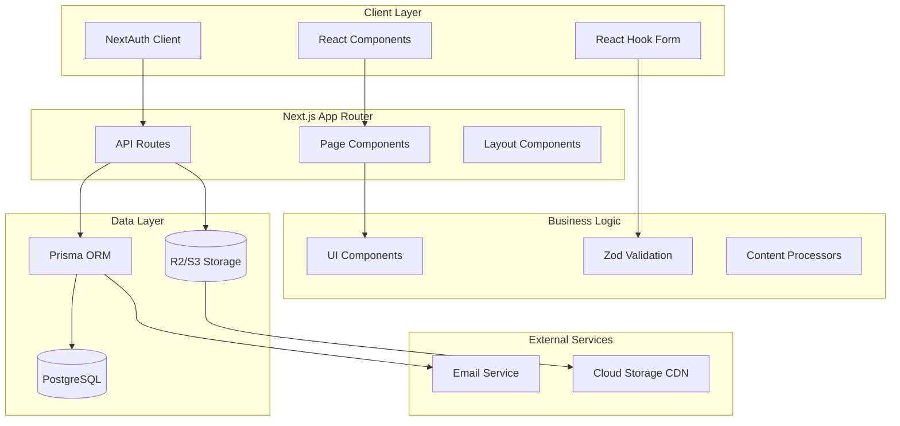
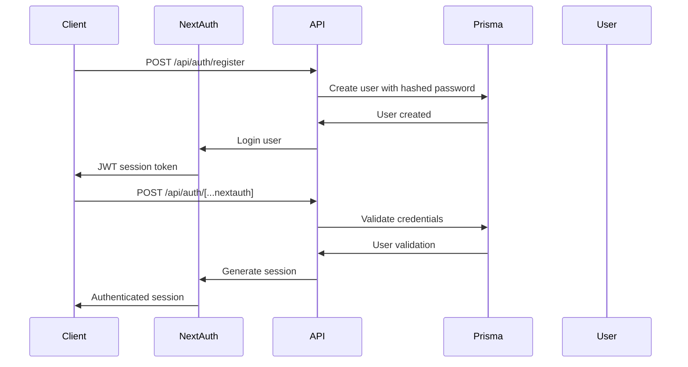
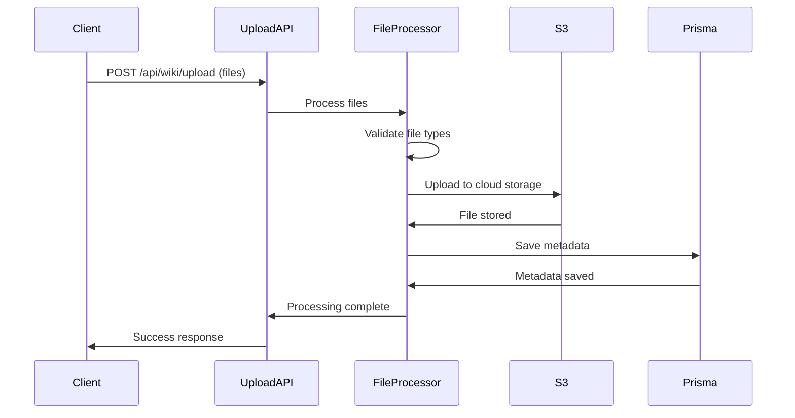
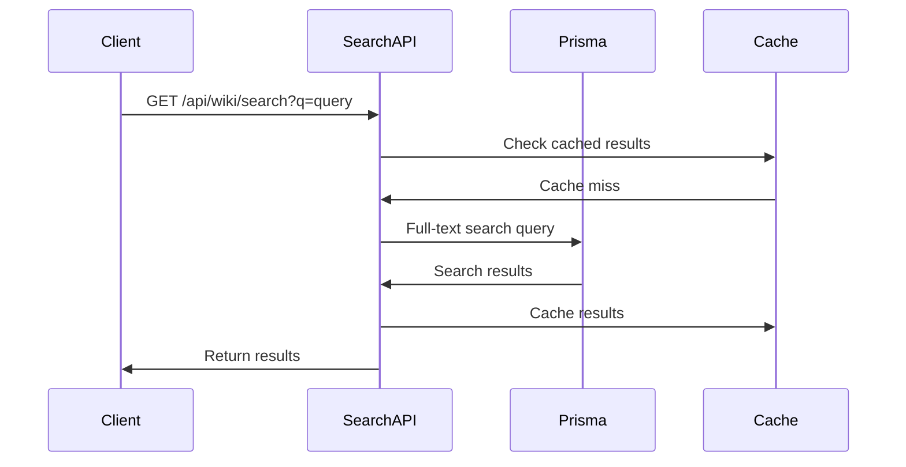

# System Architecture

[← Back to Index](index.md)

**Part of**: DeepWiki Architecture Documentation
**Generated**: 19 November 2025
**Source commit**: 2be6259

---

## High-Level System Design

DeepWiki follows a **modern full-stack architecture** built on Next.js 15 App Router, implementing a layered architecture with clear separation of concerns. The system is designed for **scalability, maintainability, and security** with containerized deployment as a first-class concern.

### Architectural Style

The application uses a **hybrid architecture** combining:
- **Server-Side Rendering (SSR)** for fast initial page loads
- **Client-Side Hydration** for interactive user interfaces
- **API Routes** for backend functionality
- **Database ORM** for type-safe data access
- **Component-based UI** for maintainable frontend

### Key Architectural Principles

- **Separation of Concerns**: Clear boundaries between UI, business logic, and data
- **Type Safety**: Full TypeScript coverage from database to UI
- **Security by Design**: Authentication required for all operations
- **Container-Native**: Docker-first deployment strategy
- **Testability**: Comprehensive test coverage (unit + E2E)
- **Performance First**: Caching, optimization, and monitoring built-in

---

## Component Overview



---

## Architecture Layers

### 1. Client Layer (React/Next.js)

**Purpose**: Interactive user interface and client-side state management

**Components**:
- **React 18.3.1**: UI library with hooks and concurrent features
- **Next.js 15**: Full-stack React framework
- **TypeScript 5.6.0**: Type-safe development
- **Tailwind CSS 3.4.13**: Utility-first styling

**Key Responsibilities**:
- Render user interfaces
- Handle user interactions
- Manage client-side state
- Form validation and submission
- Route navigation

**Source Files**:
- Pages: `app/page.tsx`, `app/dashboard/page.tsx`, `app/wiki/[slug]/page.tsx:1-50`
- Components: `components/ui/Button.tsx:15-28`, `components/WikiViewer.tsx:1-50`
- Layout: `app/layout.tsx:1-30`, `components/layout/Navigation.tsx:1-40`

### 2. API Layer (Next.js API Routes)

**Purpose**: Backend API endpoints for data operations and business logic

**Structure**:
```
app/api/
├── auth/                    # Authentication endpoints
│   ├── register/           # User registration
│   ├── [...nextauth]/      # NextAuth.js handler
│   └── reset-password/     # Password reset flow
├── wiki/                   # Wiki management
│   ├── upload/             # File upload
│   ├── search/             # Search endpoints
│   ├── [slug]/             # Wiki-specific routes
│   └── bulk-delete/        # Bulk operations
├── dashboard/              # Dashboard data
├── analytics/              # Analytics endpoints
└── health/                 # Health check
```

**Key Endpoints**:
- `app/api/auth/register/route.ts:28-42` - User registration
- `app/api/wiki/upload/route.ts:45-60` - File upload processing
- `app/api/wiki/search/route.ts:20-35` - Full-text search
- `app/api/wiki/[slug]/route.ts:30-50` - Wiki retrieval

### 3. Business Logic Layer

**Purpose**: Application business rules and content processing

**Components**:
- **Content Processors**: Markdown rendering, Mermaid diagrams
- **File Handlers**: Upload, validation, storage
- **Search Engine**: Full-text search implementation
- **Auth Logic**: User authentication and authorization
- **Form Validation**: Zod schema validation

**Key Files**:
- `lib/auth.ts:45-80` - NextAuth configuration
- `lib/markdown/renderer.ts:60-90` - Content rendering
- `lib/validations.ts:20-50` - Form validation schemas

### 4. Data Layer

**Purpose**: Data persistence and access patterns

**Technologies**:
- **Prisma 6.18.0**: Type-safe database ORM
- **PostgreSQL**: Primary database
- **Prisma Client**: Database query interface

**Models** (from `prisma/schema.prisma:16-82`):
- **User**: Authentication and user management
- **Wiki**: Wiki metadata and organization
- **WikiFile**: Individual file storage and metadata
- **WikiVersion**: Version control and change tracking

**Key Files**:
- `prisma/schema.prisma:16-82` - Database schema
- `lib/database.ts:10-25` - Prisma client configuration
- `prisma/seed.ts:30-50` - Test data seeding

### 5. Infrastructure Layer

**Purpose**: Deployment, monitoring, and external services

**Components**:
- **Docker**: Containerization and orchestration
- **PostgreSQL**: Database service
- **R2/S3 Storage**: File storage and CDN
- **Email Service**: Password reset and notifications
- **Health Checks**: Application monitoring

**Configuration Files**:
- `Dockerfile:1-42` - Container image definition
- `docker-compose.yml:1-96` - Development environment
- `next.config.js:1-58` - Next.js configuration

---

## Data Flow Architecture

### User Authentication Flow



### File Upload and Processing Flow



### Search Request Flow



---

## Component Taxonomy

### UI Components (`components/`)

| Component | File Location | Purpose | Key Props |
|-----------|---------------|---------|-----------|
| **Button** | `components/ui/Button.tsx:1-50` | Reusable button with variants | `variant`, `size`, `loading` |
| **Input** | `components/ui/Input.tsx:1-40` | Form input with validation | `type`, `error`, `label` |
| **Alert** | `components/ui/Alert.tsx:1-30` | Success/error messages | `type`, `title`, `message` |
| **LoginForm** | `components/auth/LoginForm.tsx:1-60` | User authentication | `onSubmit`, `loading` |
| **WikiViewer** | `components/WikiViewer.tsx:1-100` | Markdown rendering | `wikiId`, `files` |
| **WikiUpload** | `components/WikiUpload.tsx:1-80` | File upload interface | `onUpload`, `multiple` |
| **Navigation** | `components/layout/Navigation.tsx:1-50` | Main navigation | `user`, `currentPath` |
| **ProtectedRoute** | `components/layout/ProtectedRoute.tsx:1-40` | Route protection | `children`, `requireAdmin` |

### API Routes (`app/api/`)

| Endpoint | File Location | Method | Purpose |
|----------|---------------|---------|---------|
| **Auth Register** | `app/api/auth/register/route.ts:1-50` | POST | User registration |
| **Auth NextAuth** | `app/api/auth/[...nextauth]/route.ts:1-30` | POST | Authentication handler |
| **Wiki Upload** | `app/api/wiki/upload/route.ts:1-60` | POST | File upload |
| **Wiki Search** | `app/api/wiki/search/route.ts:1-40` | GET | Full-text search |
| **Wiki Slug** | `app/api/wiki/slug/[slug]/route.ts:1-50` | GET | Retrieve wiki by slug |
| **Dashboard Stats** | `app/api/dashboard/stats/route.ts:1-30` | GET | Dashboard metrics |
| **Health Check** | `app/api/health/route.ts:1-20` | GET | Health monitoring |

### Database Models (`prisma/schema.prisma`)

| Model | File Location | Key Fields | Relationships |
|-------|---------------|------------|---------------|
| **User** | `prisma/schema.prisma:16-27` | `id`, `email`, `password`, `role` | `wikiVersions` |
| **Wiki** | `prisma/schema.prisma:29-42` | `id`, `title`, `slug`, `description` | `files`, `versions` |
| **WikiFile** | `prisma/schema.prisma:44-59` | `id`, `fileName`, `filePath`, `contentType` | `wiki` (Cascade) |
| **WikiVersion** | `prisma/schema.prisma:61-77` | `id`, `version`, `content`, `changeLog` | `wiki`, `user` |

---

## Technology Integration Points

### Next.js App Router Integration

**File**: `app/layout.tsx:1-30`

```typescript
// Root layout with providers
export default function RootLayout({ children }) {
  return (
    <html lang="en">
      <body>
        <Providers>
          {children}
        </Providers>
      </body>
    </html>
  )
}
```

**Key Features**:
- Route-based code splitting
- Server and client components
- Automatic static optimization
- Built-in image optimization

### Prisma Integration

**File**: `lib/database.ts:10-25`

```typescript
// Prisma client configuration
import { PrismaClient } from '@prisma/client'

const globalForPrisma = globalThis as unknown as {
  prisma: PrismaClient | undefined
}

export const prisma = globalForPrisma.prisma ?? new PrismaClient()
```

### NextAuth Integration

**File**: `lib/auth.ts:45-80`

```typescript
// NextAuth.js configuration
export const { handlers, auth, signIn, signOut } = NextAuth({
  providers: [CredentialsProvider({
    credentials: { email: {}, password: {} },
    async authorize(credentials) { /* ... */ }
  })],
  session: { strategy: 'jwt' },
  callbacks: { /* ... */ }
})
```

### Tailwind CSS Integration

**File**: `tailwind.config.js:1-30`

```javascript
// Tailwind configuration with typography plugin
module.exports = {
  content: ['./app/**/*.{js,ts,jsx,tsx}'],
  theme: { /* ... */ },
  plugins: [require('@tailwindcss/typography')]
}
```

---

## Security Architecture

### Authentication & Authorization

- **NextAuth.js 5**: JWT-based session management
- **Role-based access**: USER and ADMIN roles
- **Route protection**: Automatic redirect for unauthenticated users
- **Password security**: bcrypt hashing with salt
- **Session security**: Secure JWT tokens

### Security Headers

**File**: `next.config.js:22-46`

```javascript
// Security headers configuration
async headers() {
  return [
    {
      source: '/(.*)',
      headers: [
        { key: 'X-Frame-Options', value: 'DENY' },
        { key: 'X-Content-Type-Options', value: 'nosniff' },
        { key: 'Referrer-Policy', value: 'strict-origin-when-cross-origin' }
      ]
    }
  ];
}
```

### Content Security

- **XSS Protection**: DOMPurify for content sanitization
- **Input Validation**: Zod schema validation
- **File Type Validation**: Automatic file type detection
- **SQL Injection Prevention**: Prisma ORM parameterization

---

## Performance Optimizations

### Caching Strategy

- **Multi-level caching**: Browser, CDN, database
- **Cache-Control headers**: Optimized for different content types
- **Static generation**: Pre-rendered static pages
- **Image optimization**: Next.js built-in optimization

**Cache Implementation** (from `app/api/wiki/slug/[slug]/route.ts:30-40`):
```typescript
return NextResponse.json(wiki, {
  headers: {
    'Cache-Control': 'public, max-age=300, s-maxage=300, stale-while-revalidate=600'
  }
})
```

### Code Optimization

- **Tree shaking**: Unused code elimination
- **Code splitting**: Route-based code splitting
- **Bundle optimization**: Webpack optimization
- **Image optimization**: Next.js image component

### Database Optimization

- **Indexed queries**: Prisma with proper indexes
- **Connection pooling**: Prisma connection management
- **Query optimization**: Efficient database queries

---

## Deployment Architecture

### Containerized Design

**Docker Configuration**:
- **Multi-stage build**: Optimized container image
- **Non-root user**: Security best practice
- **Health checks**: Application monitoring
- **Environment variables**: Configuration management

**File**: `Dockerfile:1-42`

```dockerfile
# Multi-stage build for optimization
FROM node:18-alpine
WORKDIR /app
RUN adduser --system --uid 1001 nextjs

# Install dependencies and build
RUN npm ci && npm cache clean --force
COPY . .
RUN npx prisma generate
RUN npm run build

# Set permissions and user
RUN chown -R nextjs:nodejs /app
USER nextjs

# Health check and start
CMD ["sh", "-c", "npx prisma db push && npm start"]
```

### Development Environment

**File**: `docker-compose.yml:1-96`

```yaml
# Development environment
services:
  app:
    build: .
    ports: ["3000:3000"]
    environment:
      - NODE_ENV=development
      - DATABASE_URL=postgresql://...
    depends_on:
      postgres:
        condition: service_healthy

  postgres:
    image: postgres:15-alpine
    environment:
      POSTGRES_DB: deepwiki
      POSTGRES_USER: deepwiki
      POSTGRES_PASSWORD: devpassword123
```

---

## Monitoring and Observability

### Health Checks

**File**: `app/api/health/route.ts:1-20`

```typescript
// Health check endpoint
export async function GET() {
  return NextResponse.json({
    status: 'healthy',
    timestamp: new Date().toISOString(),
    uptime: process.uptime()
  })
}
```

### Error Handling

- **Error boundaries**: React error boundaries
- **Global error handler**: Next.js error handling
- **API error responses**: Standardized error format
- **Logging**: Console-based logging for development

---

## Scalability Considerations

### Horizontal Scaling

- **Stateless application**: No server-side state
- **Database scaling**: PostgreSQL read replicas
- **CDN integration**: Static asset offloading
- **Container orchestration**: Docker Swarm/Kubernetes ready

### Performance Scaling

- **Database indexing**: Optimized query performance
- **Caching layers**: Multi-level caching
- **Connection pooling**: Efficient database connections
- **Asset optimization**: Code splitting and minification

### Storage Scaling

- **Cloud storage**: R2/S3 for file storage
- **CDN integration**: Global content delivery
- **File compression**: Automatic compression
- **Backup strategy**: Database and file backups

---

## Integration Architecture

### External Services

| Service | Purpose | Integration Method |
|---------|---------|-------------------|
| **Email Service** | Password reset, notifications | SMTP (Nodemailer) |
| **Cloud Storage** | File upload and serving | S3/R2 API |
| **Database** | Data persistence | PostgreSQL with Prisma |
| **CDN** | Asset delivery | Cloud storage CDN |

### API Design Patterns

- **RESTful APIs**: Standard HTTP methods
- **Consistent responses**: JSON format
- **Error handling**: Standardized error responses
- **Validation**: Zod schema validation
- **Authentication**: JWT-based API authentication

---

**Next**: [Authentication System](authentication.md) →
